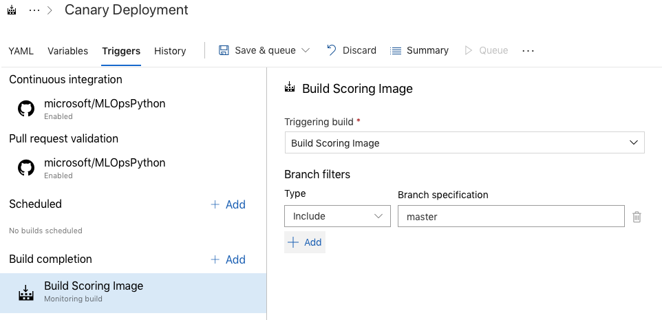

## Model deployment to a Kubernetes cluster with Canary and A/B testing deployemnt strategies.

If your target deployment environment is a K8s cluster and you want to implement [Canary and/or A/B testing deployemnt strategies](http://adfpractice-fedor.blogspot.com/2019/04/deployment-strategies-with-kubernetes.html) you can follow this sample guidance.

**Note:** It is assumed that you have an AKS instance and configured ***kubectl*** to communicate with the cluster.

#### 1. Install Istio on a K8s cluster. 

This guidance uses [Istio](https://istio.io) service mesh implememtation to control traffic routing between model versions. The instruction on installing Istio is available [here](https://docs.microsoft.com/en-us/azure/aks/servicemesh-istio-install?pivots=client-operating-system-linux).

Having the Istio installed, figure out the Istio gateway endpoint on your K8s cluster:

```bash
GATEWAY_IP=$(kubectl get svc istio-ingressgateway -n istio-system -o jsonpath='{.status.loadBalancer.ingress[0].ip}')
```

#### 2. Set up variables

There are some extra variables that you need to setup in ***devopsforai-aml-vg*** variable group:

| Variable Name               | Suggested Value                                      |
| --------------------------- | -----------------------------------------------------|
| K8S_AB_SERVICE_CONNECTION   | AzDo service connection to a K8s cluster             |
| K8S_AB_NAMESPACE            | Namespace in a K8s cluster to deploy the model       |
| IMAGE_REPO_NAME             | Image reposiory name (e.g. mlopspyciamlcr.azurecr.io)|
| IMAGE_NAME                  | Scoring image name (e.g. myscoring)                  |
| MODEL_NAME                  | Name of the registered in AML model to be deployed   |
| MODEL_VERSION               | Version of the registered in AML model to be deployed|


#### 3. Configure a pipeline to build a Scoring Image

Use [azdo-ci-image.yml](./.pipelines/azdo-ci-image.yml) to create a pipeline building a scoring image. 

```yaml
pr: none
trigger:
  branches:
    include:
    - master
  paths:
    include:
    - ml_service/util/create_scoring_image.py
    - ml_service/util/Dockerfile
    - code/scoring/
    exclude:
    - code/scoring/deployment_config_aci.yml
    - code/scoring/deployment_config_aks.yml    

pool: 
  vmImage: 'ubuntu-latest'

container: mcr.microsoft.com/mlops/python:latest

variables:
- group: devopsforai-aml-vg
- name: 'SCORE_SCRIPT'
  value: 'scoreA.py'

name: $(Date:yyyyMMdd)$(Rev:r)
steps:

- bash: |
   python3 $(Build.SourcesDirectory)/ml_service/util/create_scoring_image.py   
  failOnStderr: 'false'
  env:
    SP_APP_SECRET: '$(SP_APP_SECRET)'
    MODEL_VERSION: 1
  displayName: 'Create Scoring Image'
  enabled: 'true'
```

#### 4. Configure a deployment pipeline.

Use [azdo-release-abtest-pipeline.yml](./.pipelines/azdo-release-abtest-pipeline.yml) to configure a multistage deployment pipeline:

```yaml
variables:
- group: 'devopsforai-aml-vg'
- name: 'helmVersion'
  value: 'v3.0.0-rc.3'
- name: 'helmDownloadURL'
  value: 'https://get.helm.sh/helm-$HELM_VERSION-linux-amd64.tar.gz'
- name: 'imgTag'
  value: 1
- name: 'imgName'
  value: $(IMAGE_REPO_NAME)/$(IMAGE_NAME)-$(Build.TriggeredBy.BuildNumber)
- name: 'blueReleaseName'
  value: 'model-blue'
- name: 'greenReleaseName'
  value: 'model-green'


trigger:
- master

stages:
- stage: 'Blue_Staging'
  jobs:
  - job: "Deploy_to_Staging"
    timeoutInMinutes: 0
    steps:
    - template: azdo-helm-upgrade.yml
      parameters:
        chartPath: '$(System.DefaultWorkingDirectory)/charts/abtest-model'
        releaseName: $(blueReleaseName) 
        overrideValues: 'deployment.name=$(blueReleaseName),deployment.bluegreen=blue,deployment.image.tag=$(imgTag),deployment.image.name=$(imgName)'

    - publish: $(System.DefaultWorkingDirectory)/charts
      artifact: allcharts
...
```
Make sure that the release pipeline is configured to be triggered once the scoring image build is completed:




Manually run a pipeline building a scoring image. The result of the pipeline will be a registered Docker image in the ACR repository attached to the AML Service:


The release pipeline will be triggered automatically and it will deploy the scroring image to the Kubernetes cluster. 

```bash
kubectl get deployments --namespace abtesting
NAME          READY   UP-TO-DATE   AVAILABLE   AGE
model-green   1/1     1            1           19h
```

#### 5. Build a new Scoring Image.

Change value of the ***SCORE_SCRIPT*** variable in the [azdo-ci-image.yml](./.pipelines/azdo-ci-image.yml) to point to ***scoreA.py*** and merge it to the master branch.
It will trigger the building pipeline and the release pipeline after that.

The release pipeline deploys a new scoring image with the following stages implementing ***Canary*** deployment strategy:

| Stage               | Green Weight| Blue Weight| Description                                                     |
| ------------------- |-------------|------------|-----------------------------------------------------------------|
| Blue_0              |100          |0           |New image (blue) is deployed.<br>But all traffic (100%) is still routed to the old (green) image.|
| Blue_50             |50           |50          |Traffic is split between old (green) and new (blue) images 50/50.|
| Blue_100            |0            |100         |All traffic (100%) is routed to the blue image.|
| Blue_Green          |0            |100         |Old green image is removed. The new blue image is copied as green.<br>Blue and Green images are equal.<br>All traffic (100%) is routed to the blue image.|
| Green_100           |100          |0           |All traffic (100%) is routed to the green image.<br>The blue image is removed

At ecah stage you can verify how the traffic is routed sending requests to $GATEWAY_IP/score with ***Postman*** or with ***curl***:

```bash
curl $GATEWAY_IP/score
```

You can also emulate a simple load test on the gateway with the ***load_test.sh***:

```bash
./charts/load_test.sh 10 
```

The command above sends 10 requests to the gateway. So if the pipeline has completted stage Blue_50, the result will look like this:

```bash
"New Model A"
"New Model A"
"New Model A"
"New Model B"
"New Model A"
"New Model B"
"New Model B"
"New Model A"
"New Model A"
"New Model A"
```

Despite what blue/green weights are configured now on the cluster, you can perform ***A/B testing*** and send requests directly to either blue or green images:

```bash
./charts/load_test.sh 10 $GATEWAY_IP/score blue
./charts/load_test.sh 10 $GATEWAY_IP/score green
```
