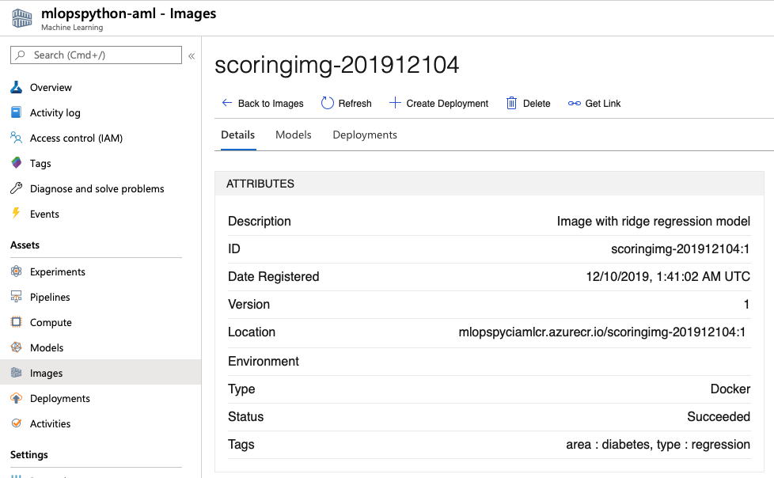

# Model deployment to AKS cluster with Canary deployment <!-- omit in toc -->

[](https://aidemos.visualstudio.com/MLOps/_build/latest?definitionId=133&branchName=master)

If your target deployment environment is a Kubernetes cluster and you want to implement [Canary and/or A/B testing deployment strategies](http://adfpractice-fedor.blogspot.com/2019/04/deployment-strategies-with-kubernetes.html) you can follow this sample guide.

- [Prerequisites](#prerequisites)
- [Install Istio on a K8s cluster](#install-istio-on-a-k8s-cluster)
- [Set up variables](#set-up-variables)
- [Configure a pipeline to build and deploy a scoring Image](#configure-a-pipeline-to-build-and-deploy-a-scoring-image)
- [Build a new Scoring Image](#build-a-new-scoring-image)

## Prerequisites

Before continuing with this guide, you will need:

* An [Azure Kubernetes Service (AKS)](https://azure.microsoft.com/en-us/services/kubernetes-service) cluster
  * This does **not** have to be the same cluster as the example in [Getting Started: Deploy the model to Azure Kubernetes Service](/docs/getting_started.md#deploy-the-model-to-azure-kubernetes-service)
  * The cluster does not have to be connected to Azure Machine Learning.
  * If you want to deploy a new cluster, see [Quickstart: Deploy an Azure Kubernetes Service cluster using the Azure CLI](https://docs.microsoft.com/en-us/azure/aks/kubernetes-walkthrough)
* An Azure Container Registry instance that is authenticated with your Azure Kubernetes Service cluster.
  * The chart you will deploy is assuming you are authenticated using a service principal.
  * See [Authenticate with Azure Container Registry from Azure Kubernetes Service](https://docs.microsoft.com/en-us/azure/aks/cluster-container-registry-integration#configure-acr-integration-for-existing-aks-clusters) for an authentication guide.
* In Azure DevOps, a service connection to your Kubernetes cluster.
  * If you do not currently have a namespace, create one named 'abtesting'.

## Install Istio on a K8s cluster

You'll be using the [Istio](https://istio.io) service mesh implementation to control traffic routing between model versions. Follow the instructions at [Install and use Istio in Azure Kubernetes Service (AKS)](https://docs.microsoft.com/azure/aks/servicemesh-istio-install?pivots=client-operating-system-linux).

After Istio is installed, figure out the Istio gateway endpoint on your K8s cluster:

```bash
GATEWAY_IP=$(kubectl get svc istio-ingressgateway -n istio-system -o jsonpath='{.status.loadBalancer.ingress[0].ip}')
```

You don't need to create any Istio resources (e.g. Gateway or VirtualService) at this point. It will be handled by the AzDo pipeline that builds and deploys a scoring image.

## Set up variables

There are some extra variables that you need to setup in ***devopsforai-aml-vg*** variable group (see [getting started](./getting_started.md)):

| Variable Name             | Suggested Value       | Short Description                                         |
|---------------------------|-----------------------|-----------------------------------------------------------|
| K8S_AB_SERVICE_CONNECTION | mlops-aks             | Name of the service connection to your Kubernetes cluster |
| K8S_AB_NAMESPACE          | abtesting             | Kubernetes namespace for model deployment                 |
| IMAGE_REPO_NAME           | [Your ACR's DNS name] | Image reposiory name (e.g. mlopspyciamlcr.azurecr.io)     |

## Configure a pipeline to build and deploy a scoring Image

Import and run the [abtest.yml](./.pipelines/abtest.yml) multistage deployment pipeline.

After the pipeline completes successfully, you will see a registered Docker image in the ACR repository attached to the Azure ML Service:



The pipeline creates Istio Gateway and VirtualService and deploys the scoring image to the Kubernetes cluster.

```bash
kubectl get deployments --namespace abtesting
NAME          READY   UP-TO-DATE   AVAILABLE   AGE
model-green   1/1     1            1           19h
```

## Build a new Scoring Image

Change value of the ***SCORE_SCRIPT*** variable in the [abtest.yml](./.pipelines/abtest.yml) to point to ***scoring/scoreA.py*** and merge it to the master branch.

**Note:** ***scoreA.py*** and ***scoreB.py*** files used in this tutorial are just mockups returning either "New Model A" or "New Model B" respectively. They are used to demonstrate the concept of testing two scoring images with different models or scoring code. In real life you would implement a scoring file similar to [score.py](./../code/scoring/score.py) (see the [Getting Started](./getting_started.md) guide).

It will automatically trigger the pipeline and deploy a new scoring image with the following stages implementing ***Canary*** deployment strategy:

| Stage      | Green Weight | Blue Weight | Description                                                                                                                                               |
|------------|--------------|-------------|-----------------------------------------------------------------------------------------------------------------------------------------------------------|
| Blue_0     | 100          | 0           | New image (blue) is deployed.<br>But all traffic (100%) is still routed to the old (green) image.                                                         |
| Blue_50    | 50           | 50          | Traffic is split between old (green) and new (blue) images 50/50.                                                                                         |
| Blue_100   | 0            | 100         | All traffic (100%) is routed to the blue image.                                                                                                           |
| Blue_Green | 0            | 100         | Old green image is removed. The new blue image is copied as green.<br>Blue and Green images are equal.<br>All traffic (100%) is routed to the blue image. |
| Green_100  | 100          | 0           | All traffic (100%) is routed to the green image.<br>The blue image is removed.                                                                            |

**Note:** The pipeline performs the rollout without any pausing. You may want to configure [Approvals and Checks](https://docs.microsoft.com/en-us/azure/devops/pipelines/process/approvals?view=azure-devops&tabs=check-pass) for the stages on your environment for better experience of the model testing. The environment ***abtestenv*** will be added automatically to your AzDo project after the first pipeline run.

At each stage you can verify how the traffic is routed sending requests to $GATEWAY_IP/score with ***Postman*** or with ***curl***:

```bash
curl $GATEWAY_IP/score
```

You can also emulate a simple load test on the gateway with the ***load_test.sh***:

```bash
./charts/load_test.sh 10 $GATEWAY_IP/score
```

The command above sends 10 requests to the gateway. So if the pipeline has completed stage Blue_50, the result will look like this:

```bash
"New Model A"
"New Model A"
"New Model A"
"New Model B"
"New Model A"
"New Model B"
"New Model B"
"New Model A"
"New Model A"
"New Model A"
```

Regardless of the blue/green weight values set on the cluster, you can perform ***A/B testing*** and send requests directly to either blue or green images:

```bash
curl --header "x-api-version: blue" $GATEWAY_IP/score
curl --header "x-api-version: green" $GATEWAY_IP/score
```

or with a load_test.sh script:

```bash
./charts/load_test.sh 10 $GATEWAY_IP/score blue
./charts/load_test.sh 10 $GATEWAY_IP/score green
```

In this case the Istio Virtual Service analyzes the request header and routes the traffic directly to the specified model version.
