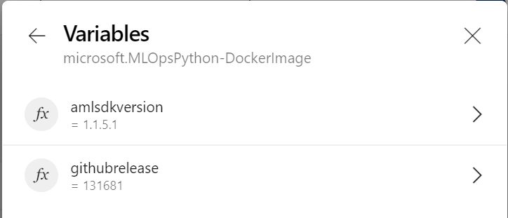

# Azure DevOpsジョブコンテナのカスタマイズ

モデルのトレーニングとデプロイメントのパイプラインでは、Dockerコンテナを使用します。
を Azure Pipelines エージェント上で使用し、テストやデプロイメントコードを実行するための再現性の高い環境を提供します。
 コンテナのイメージ `mcr.microsoft.com/mlops/python:latest` は
[Dockerfile](./environment_setup/Dockerfile)を使用してビルドされています。

また、mcr.microsoft.com/mlops/pythonのイメージには以下のタグが付けられています。

| イメージタグ                                      | 概要                                                                               |
| ----------------------------------------------- | :---------------------------------------------------------------------------------------- |
| mcr.microsoft.com/mlops/python:latest           | 最新のイメージ                                                                              |
| mcr.microsoft.com/mlops/python:build-[id]       | [id]はAzure DevopsのビルドIDです。 例: mcr.microsoft.com/mlops/python:build-20200325.1 |
| mcr.microsoft.com/mlops/python:amlsdk-[version] | [version]はaml sdkのバージョンです。例: mcr.microsoft.com/mlops/python:amlsdk-1.1.5.1    |
| mcr.microsoft.com/mlops/python:release-[id]     | [id]はgithubのリリースIDです。例: mcr.microsoft.com/mlops/python:release-3.0.0        |  |

プロジェクトでは、ユースケースに必要な依存関係とツールだけを含む独自のDockerイメージを構築したい場合があります。この画像は、より小さく、より高速になる可能性が高く、あなたのチームで完全にメンテナンスされます。

## Azure Container Registry のプロビジョニング

モデルを管理するために、Azure ML ワークスペースに沿って Azure Container Registry がデプロイされます。
そのレジストリインスタンスを使用して MLOps コンテナイメージを保存することも、別のインスタンスをプロビジョニングすることも可能です。

## レジストリサービス接続の作成

Azure Container Registrへの[サービス接続を作成]((https://docs.microsoft.com/en-us/azure/devops/pipelines/library/service-endpoints?view=azure-devops&tabs=yaml#sep-docreg) )します。

- *Connection type*として、*Docker Registry*を選択します。
- *Registry type*として、*Azure Container Registry*を選択します。
- *Azure container registry*として、コンテナレジストリインスタンスを選択します。
- *Service connection name*として `acrconnection` と入力します。

##  環境定義を更新する

[Dockerfile](./environment_setup/Dockerfile)や
[ci_dependencies.yml](../diabetes_regression/ci_dependencies.yml) CI conda
環境定義を使って環境をカスタマイズすることができます。
Condaは[Azure Machine Learningでのトレーニングとデプロイのための再利用可能な環境](https://docs.microsoft.com/ja-jp/azure/machine-learning/how-to-use-environments)を提供しています。  
CIに使用するConda環境は、Azure MLのトレーニング環境やスコアリング環境に使用するConda環境と同じパッケージバージョンを使用する必要があります（[conda_dependencies.yml](./diabetes_regression/conda_dependencies.yml)で定義されています）。
これにより、MLパイプラインで使用されているものと全く同じ依存関係を使用して、ユニットテストや統合テストを実行することができます。

パッケージがCondaパッケージリポジトリで利用可能な場合は、pipインストールではなくCondaインストールを使用することをお勧めします。Conda パッケージには通常、インストールをより信頼性の高いものにするためのバイナリがあらかじめ用意されています。


## コンテナビルドパイプラインの作成

[Azure DevOps](https://dev.azure.com)プロジェクトでは[environment_setup/docker-image-pipeline.yml](../environment_setup/docker-image-pipeline.yml)
パイプラインの定義をフォークしたリポジトリで編集してください。

[environment_setup/docker-image-pipeline.yml](./environment_setup/docker-image-pipeline.yml)ファイルを編集します。
を変更し、文字列 `'public/mlops/python'` をあなたの環境を表すのに適した名前に変更してください。  
例: `'mlops/diabetes_regression'`.

保存してパイプラインを実行し、`amlsdkversion` と `githubrelease` というランタイム変数を設定します。これらの値は環境に応じて設定してください。これらの値はイメージ上にタグとして表示されます。



これでコンテナイメージがビルドされ、先ほど編集した名前でAzure Container Registryにプッシュされます。  
次のステップは、そのイメージから実行されたコンテナ上でCIジョブを実行するために、ビルドパイプラインを変更することです。

## Modify the model pipeline

モデルパイプラインファイル[diabetes_regression-ci.yml](./.pipelines/diabetes_regression-ci.yml)のこのセクションを置き換えて修正します。

```
resources:
  containers:
  - container: mlops
    image: mcr.microsoft.com/mlops/python:latest
```

あわせて事前に定義したイメージ名を使用を使用します。

```
resources:
  containers:
  - container: mlops
    image: mlops/diabetes_regression
    endpoint: acrconnection
```

パイプラインを実行し、コンテナが使用されていることを確認します。

## 相反する依存関係への対処

特にチームで作業をしていると、ブランチ間での環境変更がお互いに干渉してしまうことがあります。

例えば、マスターブランチが scikit-learn を使用していて、代わりに Tensorflow を使用するブランチを作成したとします。
もし、[ci_dependencies.yml](./diabetes_regression/ci_dependencies.yml)のConda環境定義からscikit-learnを削除することにして、[docker-image-pipeline.yml](./environment_setup/docker-image-pipeline.yml)のDockerイメージを実行すると、masterブランチのビルドが停止します。

Tensorflow に加えて scikit-learn を環境に残しておくこともできますが、 master ブランチをマージした後に scikit-learn を削除するための余分なステップを踏まなければならないので、理想的ではありません。

より良いアプローチは、`mlops/diabetes_regression/tensorflow`のように、変更した環境に別の名前を使うことです。  
コンテナビルドパイプライン[environment_setup/docker-image-pipeline.yml](./environment_setup/docker-image-pipeline.yml)とモデルパイプラインファイル[diabetes_regression-ci.yml](./.pipelines/diabetes_regression-ci.yml)の両方でブランチ内のイメージの名前を変更し、ブランチ上で順番に実行することで、ブランチの競合を回避し、masterにマージした後に名前を変更する必要がありません。
