## Getting Started with this Repo

### 1. Get the source code
- Either clone the repository to your workspace and create your own repo with the code in GitHub.
- An easier way is to just fork the project, so you have the repository under your username on GitHub itself.


### 2. Create Azure DevOps account
We use Azure DevOps for running our build(CI), retraining trigger and release (CD) pipelines. If you don't already have Azure DevOps account, create one by following the instructions [here](https://docs.microsoft.com/en-us/azure/devops/organizations/accounts/create-organization?view=azure-devops)

If you already have Azure DevOps account, create a [new project](https://docs.microsoft.com/en-us/azure/devops/organizations/projects/create-project?view=azure-devops).


### 3. Create Service Principal to Login to Azure

To create service principal, register an application entity in Azure Active Directory (Azure AD) and grant it the Contributor or Owner role of the subscription or the resource group where the web service belongs to. See [how to create service principal](https://docs.microsoft.com/en-us/azure/active-directory/develop/howto-create-service-principal-portal) and assign permissions to manage Azure resource.
Please make note of the following values after creating a service principal, we will need them in subsequent steps
- Application (client) ID
- Directory (tenant) ID
- Application Secret


**Note:** You must have sufficient permissions to register an application with your Azure AD tenant, and assign the application to a role in your Azure subscription. Contact your subscription administrator if you don't have the permissions. Normally a subscription admin can create a Service principal and can provide you the details.


### 4. Create a Variable Group

We make use of variable group inside Azure DevOps to store variables and their values that we want to make available across multiple pipelines. You can either store the values directly in [Azure DevOps](https://docs.microsoft.com/en-us/azure/devops/pipelines/library/variable-groups?view=azure-devops&tabs=designer#create-a-variable-group) or connect to an Azure Key Vault in your subscription. Please refer to the documentation [here](https://docs.microsoft.com/en-us/azure/devops/pipelines/library/variable-groups?view=azure-devops&tabs=designer#create-a-variable-group) to learn more about how to create a variable group and [link](https://docs.microsoft.com/en-us/azure/devops/pipelines/library/variable-groups?view=azure-devops&tabs=designer#use-a-variable-group) it to your pipeline. Click on **Library** in the **Pipelines** section as indicated below:


 
Please name your variable group **``devopsforai-aml-vg``** as we are using this name within our build yaml file. 

The variable group should contain the following variables:

| Variable Name               | Suggested Value              |
| --------------------------- | ---------------------------- |
| AML_COMPUTE_CLUSTER_CPU_SKU | STANDARD_DS2_V2              |
| AML_COMPUTE_CLUSTER_NAME    | train-cluster                |
| BASE_NAME                   | [unique base name]                        |
| EVALUATE_SCRIPT_PATH        | evaluate/evaluate_model.py   |
| EXPERIMENT_NAME             | mlopspython                  |
| LOCATION                    | centralus                    |
| MODEL_NAME                  | sklearn_regression_model.pkl |
| REGISTER_SCRIPT_PATH        | register/register_model.py   |
| SOURCES_DIR_TRAIN           | code                         |
| SP_APP_ID                   |                              |
| SP_APP_SECRET               |                              |
| SUBSCRIPTION_ID             |                              |
| TENANT_ID                   |                              |
| TRAIN_SCRIPT_PATH           | training/train.py            |
| TRAINING_PIPELINE_NAME      | training-pipeline            |

Mark **SP_APP_SECRET** variable as a secret one.

**Note:** The BASE_NAME parameter is used throughout the solution for naming Azure resources. When the solution is used in a shared subscription, there can be naming collisions with resources that require unique names like azure blob storage and registry DNS naming. Make sure to give a unique value to the BASE_NAME variable (e.g. MyUniqueML), so that the created resources will have unique names (e.g. MyUniqueML-AML-RG, MyUniqueML-AML-WS, etc.). The length of the BASE_NAME value should not exceed 10 characters. 

Make sure to select the **Allow access to all pipelines** checkbox in the variable group configuration.

Up until now you should have: 
- Forked (or cloned) the repo
- Created a devops account or use an existing one
- Got service principal details and subscription id
- A variable group with all configuration values

### 5. Create resources 

The easiest way to create all required resources (Resource Group, ML Workspace, Container Registry, Storage Account, etc.) is to leverage an "Infrastructure as Code" [pipeline coming in this repository](../environment_setup/iac-create-environment.yml). This **IaC** pipeline takes care of all required resources basing on these [ARM templates](../environment_setup/arm-templates/cloud-environment.json). The pipeline requires an **Azure Resource Manager** service connection:


Give the connection name **``AzureResourceConnection``** as it is referred by the pipeline definition. Leave the **``Resource Group``** field empty.

In your DevOps project create a build pipeline from your forked **GitHub** repository: 


Refer to an **Existing Azure Pipelines YAML file**: 


Having done that, run the pipeline:


Check out created resources in the [Azure Portal](portal.azure.com):


Alternatively, you can also use a [cleaning pipeline](../environment_setup/iac-remove-environment.yml) that removes resources created for this project or you can just delete a resource group in the [Azure Portal](portal.azure.com).

Once this resource group is created, be sure that the Service Principal you have created has access to this resource group.

### 6. Set up Build Pipeline

In your [Azure DevOps](https://dev.azure.com) project create and run a new build pipeline refereing to [azdo-ci-build-train.yml](../.pipelines/azdo-ci-build-train.yml) pipeline in your forked **GitHub** repository:


Name the pipeline **ci-build**. Once the pipline is finished, explore the execution logs: 

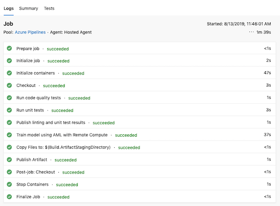

and checkout a published training pipeline in the **mlops-AML-WS** workspace in [Azure Portal](https://ms.portal.azure.com/):


Great, you now have the build pipeline setup, you can either manually trigger it or it gets automatically triggered everytime there is a change in the master branch. The pipeline performs linting, unit testing, builds and publishes an **ML Training Pipeline** in an **ML Workspace**

### 7. Train the Model

The next step is to invoke the training pipeline created in the previous step. It can be done with a **Release Pipeline**. Click on the Pipelines/Releases menu, and then **New pipeline**, and then click on "Empty Job" on the "Select a template" window that pops to the right:

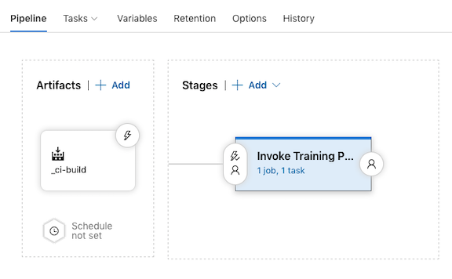

An artifact of this pipeline will be the result of the build pipeline **ci-buid**:

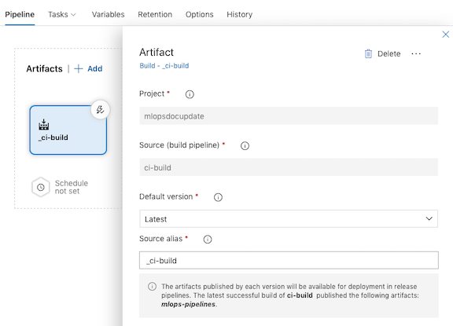

Configure a pipeline to see values from the previously defined variable group **devopsforai-aml-vg**. Click on the "Variable groups", and to the right, click on "Link variable group". From there, pick the **devopsforai-aml-vg** variable group we created in an earlier step, choose "Release" as a variable group scope, and click on "Link":

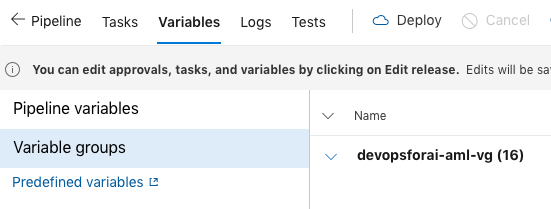

Rename the default "Stage 1" to **Invoke Training Pipeline** and make sure that the **Agent Specification** is **ubuntu-16.04** under the Agent Job:

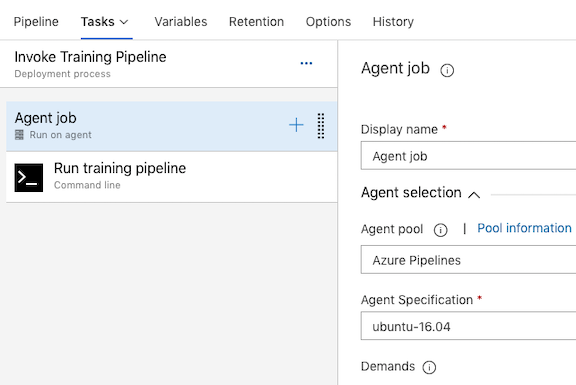

Add a **Command Line Script** step, rename it to **Run Training Pipeline** with the following script:

```bash
docker run -v $(System.DefaultWorkingDirectory)/_ci-build/mlops-pipelines/ml_service/pipelines:/pipelines \
 -w=/pipelines -e MODEL_NAME=$MODEL_NAME -e EXPERIMENT_NAME=$EXPERIMENT_NAME \
 -e TENANT_ID=$TENANT_ID -e SP_APP_ID=$SP_APP_ID -e SP_APP_SECRET=$(SP_APP_SECRET) \
 -e SUBSCRIPTION_ID=$SUBSCRIPTION_ID -e RELEASE_RELEASEID=$RELEASE_RELEASEID \
 -e BUILD_BUILDID=$BUILD_BUILDID -e BASE_NAME=$BASE_NAME \
mcr.microsoft.com/mlops/python:latest python run_train_pipeline.py
```

as in the screen shot below, leaving all other fields to their default value:

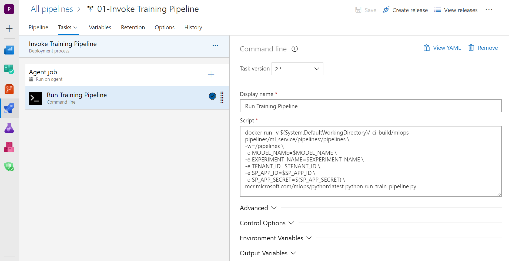

Now, add the automation to trigger a run of this pipeline whenever the **ci_build** build is completed, click on the lightning bolt icon on the top right of the **\_ci-build** artifact is selected, and enable the automatic release :


This release pipeline should now be automatically triggered (continuous deployment) whenever a new **ML training pipeline** is published by the **ci-build builder pipeline**. It can also be triggered manually or configured to run on a scheduled basis. Create a new release to trigger the pipeline manually by clicking on the "Create release" button on the top right of your screen, when selecting this new build pipeline:

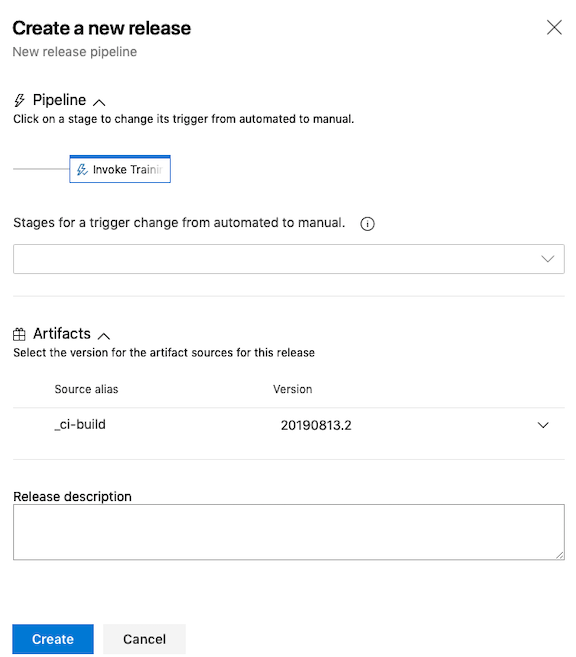

Leave the fields empty and click on "create". Once the release pipeline is completed, check out in the **ML Workspace** that the training pipeline is running: 

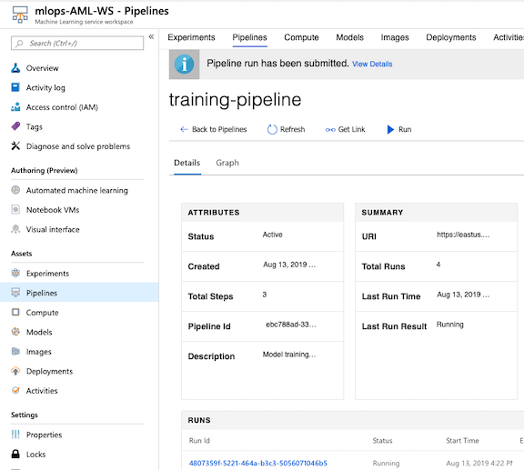

The training pipeline will train, evaluate and register a new model. Wait until it is fininshed and make sure there is a new model in the **ML Workspace**:


Good! Now we have a trained model.

### 8. Deploy the Model

The final step is to deploy the model across environments with a release pipeline. There will be a **``QA``** environment running on [Azure Container Instances](https://azure.microsoft.com/en-us/services/container-instances/) and a **``Prod``** environment running on [Azure Kubernetes Service](https://azure.microsoft.com/en-us/services/kubernetes-service). This is the final picture of what your release pipeline should look like:

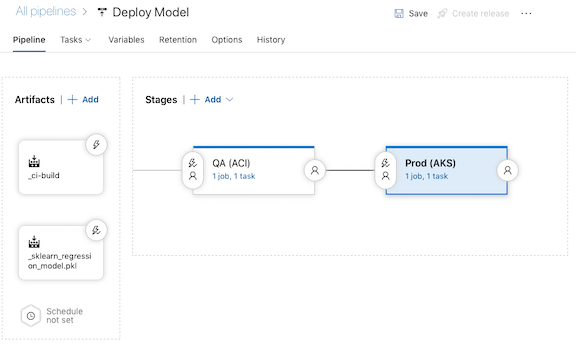


This pipeline leverages the **Azure Machine Learning** extension that should be installed in your organization from the [marketplace](https://marketplace.visualstudio.com/items?itemName=ms-air-aiagility.vss-services-azureml).

The pipeline consumes two artifacts: the result of the **Build Pipeline** as it contains configuration files and the **model** trained and registered by the ML training pipeline. 

Add the **\_ci-build** artifact using the same process as what we did in the previous step. 

In order to configure a model artifact there should be a service connection to **mlops-AML-WS** workspace. To get there, go to the project settings (by clicking on the cog wheel to the bottom left of the screen), and then click on **Service connections** under the **Pipelines** section:

**Note:** Creating service connection using Azure Machine Learning extension requires 'Owner' or 'User Access Administrator' permissions on the Workspace.

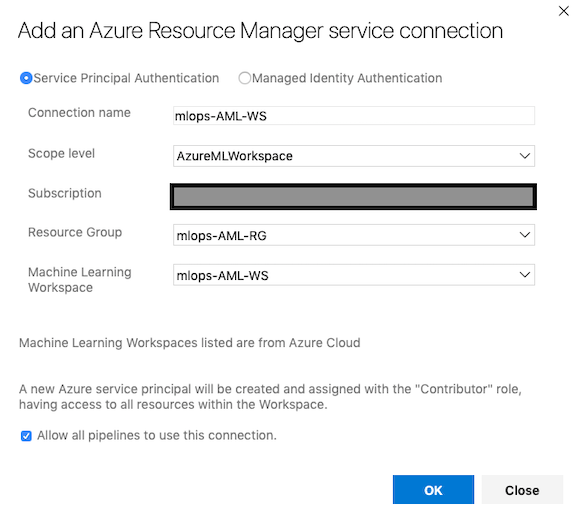

Add an artifact to the pipeline and select **AzureML Model Artifact** source type. Select the **Service Endpoint** and **Model Names** from the drop down lists. **Service Endpoint** refers to the **Service connection** created in the previous step:

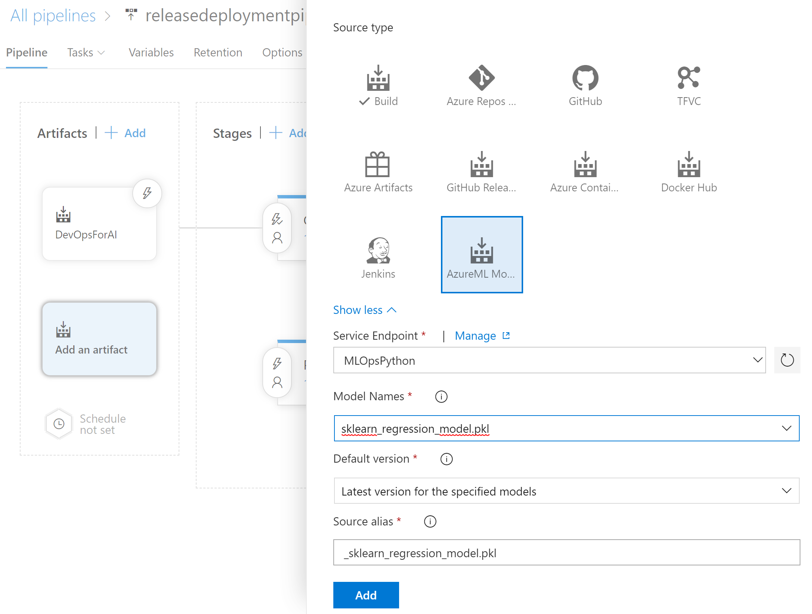

Go to the new **Releases Pipelines** section, and click new to create a new release pipeline. A first stage is automatically created and choose **start with an Empty job**. Name the stage **QA (ACI)** and add a single task to the job **Azure ML Model Deploy**. Make sure that the Agent Specification is ubuntu-16.04 under the Agent Job: 

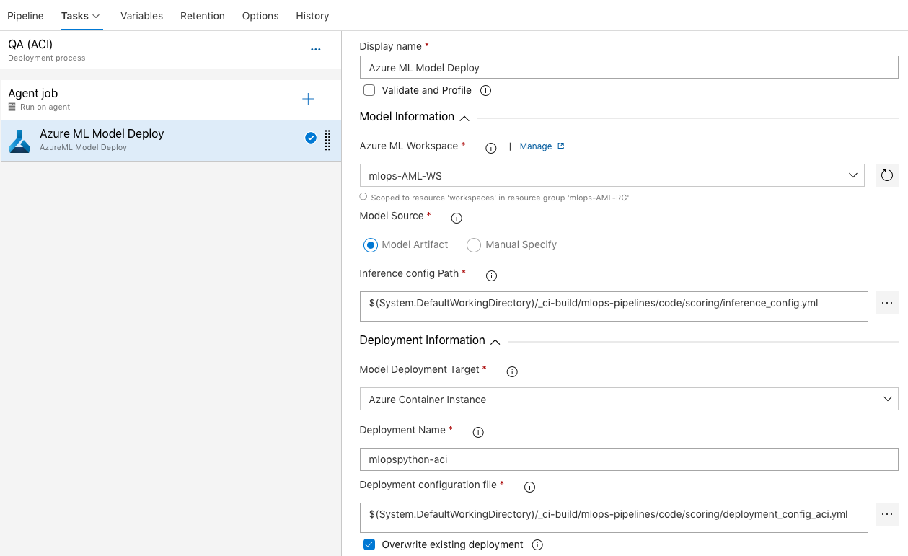

Specify task parameters as it is shown in the table below:


| Parameter                     | Value                                                                                                |
| ----------------------------- | ---------------------------------------------------------------------------------------------------- |
| Display Name                  | Azure ML Model Deploy                                                                                |
| Azure ML Workspace            | mlops-AML-WS                                                                                         |
| Inference config Path         | `$(System.DefaultWorkingDirectory)/_ci-build/mlops-pipelines/code/scoring/inference_config.yml`      |
| Model Deployment Target       | Azure Container Instance                                                                             |
| Deployment Name               | mlopspython-aci                                                                                      |
| Deployment Configuration file | `$(System.DefaultWorkingDirectory)/_ci-build/mlops-pipelines/code/scoring/deployment_config_aci.yml` |
| Overwrite existing deployment | X                                                                                                    |


In a similar way create a stage **Prod (AKS)** and add a single task to the job **Azure ML Model Deploy**. Make sure that the Agent Specification is ubuntu-16.04 under the Agent Job: 

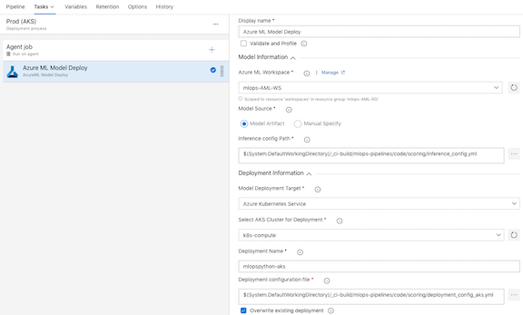

Specify task parameters as it is shown in the table below:

| Parameter                         | Value                                                                                                |
| --------------------------------- | ---------------------------------------------------------------------------------------------------- |
| Display Name                      | Azure ML Model Deploy                                                                                |
| Azure ML Workspace                | mlops-AML-WS                                                                                         |
| Inference config Path             | `$(System.DefaultWorkingDirectory)/_ci-build/mlops-pipelines/code/scoring/inference_config.yml`      |
| Model Deployment Target           | Azure Kubernetes Service                                                                             |
| Select AKS Cluster for Deployment | YOUR_DEPLOYMENT_K8S_CLUSTER                                                                          |
| Deployment Name                   | mlopspython-aks                                                                                      |
| Deployment Configuration file     | `$(System.DefaultWorkingDirectory)/_ci-build/mlops-pipelines/code/scoring/deployment_config_aks.yml` |
| Overwrite existing deployment     | X                                                                                                    |

Similarly to the **Invoke Training Pipeline** release pipeline, previously created, in order to trigger a coutinuous integration, click on the lightning bolt icon, make sure the **Continuous deployment trigger** is checked and save the trigger:

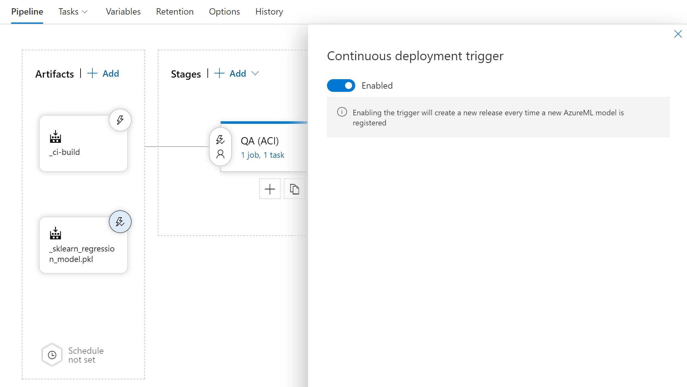

**Note:** Creating of a Kubernetes cluster on AKS is out of scope of this tutorial, so you should take care of it on your own.

**Deploy trained model to Azure Web App for containers**

Note: This is an optional step and can be used only if you are deploying your scoring service on Azure Web Apps.

[Create Image Script](../ml_service/util/create_scoring_image.py)
can be used to create a scoring image from the release pipeline. Image created by this script will be registered under Azure Container Registry (ACR) instance that belongs to Azure Machine Learning Service. Any dependencies that scoring file depends on can also be packaged with the container with Image config. To learn more on how to create a container with AML SDK click [here](https://docs.microsoft.com/en-us/python/api/azureml-core/azureml.core.image.image.image?view=azure-ml-py#create-workspace--name--models--image-config-).

Below is release pipeline with two tasks one to create an image using the above script and second is the deploy the image to Web App for containers  
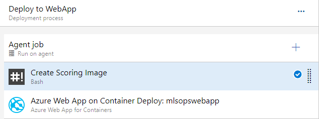

For the bash script task to invoke the [Create Image Script](../ml_service/util/create_scoring_image.py), specify the following task parameters:

| Parameter          | Value                                                                                               |
| ------------------ | --------------------------------------------------------------------------------------------------- |
| Display Name       | Create Scoring Image                                                                                |
| Script             | python3 $(System.DefaultWorkingDirectory)/\_MLOpsPythonRepo/ml_service/util/create_scoring_image.py  |

Finally 
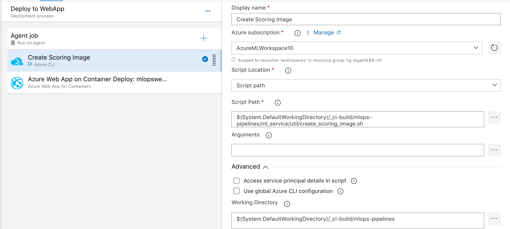

Finally for the Azure WebApp on Container Task, specify the following task parameters as it is shown in the table below:


| Parameter          | Value                                                                                               |
| ------------------ | --------------------------------------------------------------------------------------------------- |
| Azure subscription | Subscription used to deploy Web App                                                                 |
| App name           | Web App for Containers name                                                                         |
| Image name         | Specify the fully qualified container image name. For example, 'myregistry.azurecr.io/nginx:latest' |

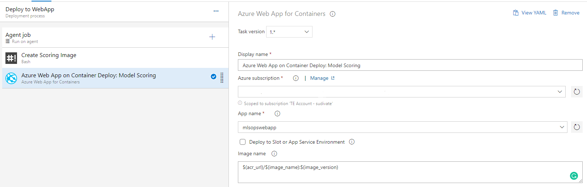


Save the pipeline and create a release to trigger it manually. To create the trigger, click on the "Create release" button on the top right of your screen, leave the fields blank and click on **Create** at the bottom of the screen. Once the pipeline execution is finished, check out deployments in the **mlops-AML-WS** workspace.


Congratulations! You have three pipelines set up end to end:
   - Build pipeline: triggered on code change to master branch on GitHub, performs linting, unit testing and publishing a training pipeline
   - Release Trigger pipeline: runs a published training pipeline to train, evaluate and register a model
   - Release Deployment pipeline: deploys a model to QA (ACI) and Prod (AKS) environments
    
