## Getting Started with this Repo

### 1. Get the source code
- Either clone the repository to your workspace and create your own repo with the code in GitHub.
- An easier way is to just fork the project, so you have the repository under your username on GitHub itself.

### 2. Create Azure DevOps account
We use Azure DevOps for running our build(CI), retraining trigger and release (CD) pipelines. If you don't already have Azure DevOps account, create one by following the instructions [here](https://docs.microsoft.com/en-us/azure/devops/organizations/accounts/create-organization?view=azure-devops)

If you already have Azure DevOps account, create a [new project](https://docs.microsoft.com/en-us/azure/devops/organizations/projects/create-project?view=azure-devops).

#### Enable Azure DevOps Preview
The steps below uses the latest DevOps features. Thus, please enable the feature **New YAML pipeline creation experience** by following the instructions [here](https://docs.microsoft.com/en-us/azure/devops/project/navigation/preview-features?view=azure-devops). 

**Note:** Make sure you have the right permissions in Azure DevOps to do so.

### 3. Create Service Principal to Login to Azure and create resources

To create service principal, register an application entity in Azure Active Directory (Azure AD) and grant it the Contributor or Owner role of the subscription or the resource group where the web service belongs to. See [how to create service principal](https://docs.microsoft.com/en-us/azure/active-directory/develop/howto-create-service-principal-portal) and assign permissions to manage Azure resource.
Please make note the following values after creating a service principal, we will need them in subsequent steps
- Azure subscription id (subscriptionid)
- Service principal username (spidentity)([application id](https://docs.microsoft.com/en-us/azure/active-directory/develop/howto-create-service-principal-portal#get-application-id-and-authentication-key))
- Service principal password (spsecret) ([auth_key](https://docs.microsoft.com/en-us/azure/active-directory/develop/howto-create-service-principal-portal#get-application-id-and-authentication-key))
- Service principal [tenant id](https://docs.microsoft.com/en-us/azure/active-directory/develop/howto-create-service-principal-portal#get-tenant-id) (sptenant)

**Note:** You must have sufficient permissions to register an application with your Azure AD tenant, and assign the application to a role in your Azure subscription. Contact your subscription adminstator if you don't have the permissions. Normally a subscription admin can create a Service principal and can provide you the details.

### 4. Store secret in Key Vault and link it as variable group in Azure DevOps to be used by piplines.
Our pipeline require the following variables to autheticate with Azure.
- spidentity 
- spsecret
- sptenant
- subscriptionid

We noted the value of these variables in previous steps.

**NOTE:** These values should be treated as secret as they allow access to your subscription. 

We make use of variable group inside Azure DevOps to store variables and their values that we want to make available across multiple pipelines. You can either store the values directly in [Azure DevOps](https://docs.microsoft.com/en-us/azure/devops/pipelines/library/variable-groups?view=azure-devops&tabs=designer#create-a-variable-group) or connect to an Azure Key Vault in your subscription. Please refer to the documentation [here](https://docs.microsoft.com/en-us/azure/devops/pipelines/library/variable-groups?view=azure-devops&tabs=designer#create-a-variable-group) to learn more about how to create a variable group and [link](https://docs.microsoft.com/en-us/azure/devops/pipelines/library/variable-groups?view=azure-devops&tabs=designer#use-a-variable-group) it to your pipeline.
 
Please name your variable group **``AzureKeyVaultSecrets``**, we are using this name within our build yaml file. 

Up until now you shouls have 
- Forked (or cloned) the repo
- Created a devops account or use an existing one
- Got service principal details and subscription id
- Set them as variable group within devops

We now have 3 pipelines that we would set up
- **Build Pipeline (azure-pipelines.yml)**: Runs tests and sets up infrastructure 
- **Retraining trigger pipeline(/template/retraining-template.json)**: This pipeline triggers Azure ML Pipeline (training/retraining) which trains a new model and publishes model image, if new model performs better
- **Release pipeline(/template/release-template.json)**: This pipeline deploys and tests model image as web service in QA and Prod environment

### 5. Set up Build Pipeline
1. Select your devops organization and project by clicking dev.azure.com
2. Once you are in the right devops project, click Pipelines on the left hand menu and select Builds
3. Click **New pipeline** to create new pipeline
   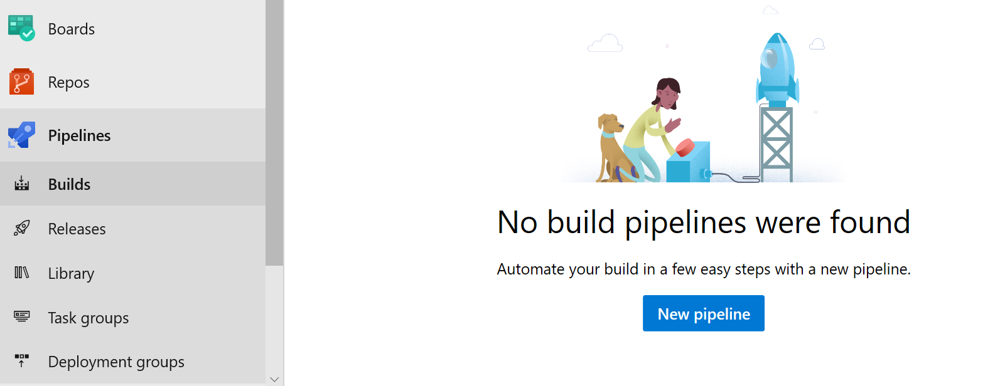   
4. On the Connect option page, select **GitHub**
   
   
5. On the Select option page, select the GitHub repository where you forked the code.

6. Authorize Azure Pipelines to access your git account

7. Since the repository contains azure-pipelines.yml at the root level, Azure DevOps recognizes it and auto imports it. Click **Run** and this will start the build pipeline.
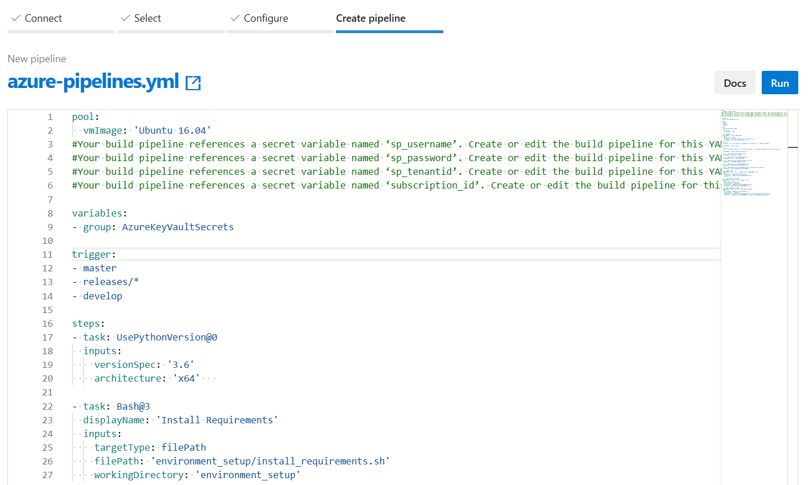 

8. Your build run would look similar to the following image
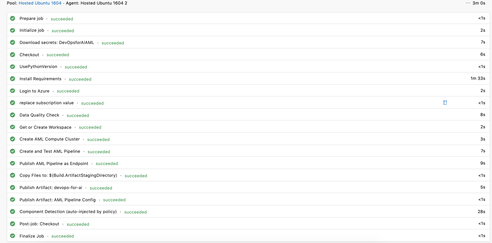

Great, you now have the build pipeline setup, you can either manually trigger it or it gets automatically triggered everytime there is a change in the master branch.

**Note:** The build pipeline will perform basic test on the code and provision infrastructure on azure. This can take around 10 mins to complete.

### 6. Set up Retraining trigger release pipeline

**Note:** For setting up release pipelines, first download the [release-pipelines](../release-pipelines) to your local filesystem so you can import it.

**Also Note:** If this is the first time you are creating a release pipeline, you would see the following option, click on **New Pipeline**
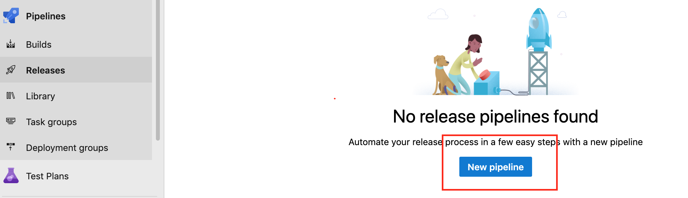

To enable the option to **Import release pipeline**, we must have atleast one release pipeline so let's create one with an empty job.
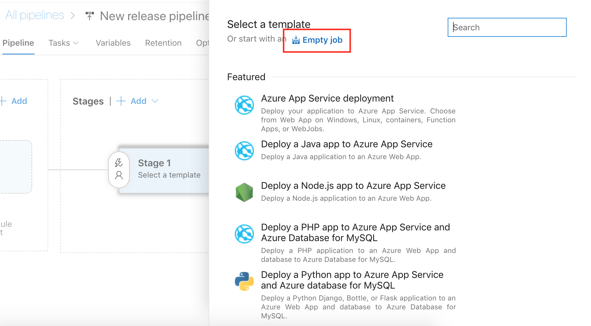

On the next screen, click on **Save** and then click **Ok** to save the empty release pipeline.
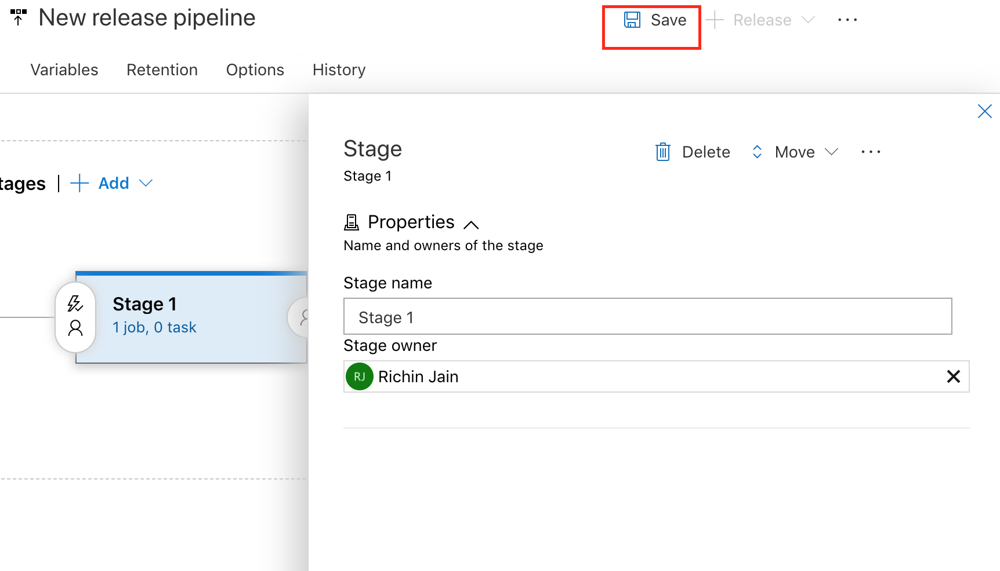

**Steps**

1. Select the Release tab from the menu on the left, then click the New dropdown on top and click on **Import Release pipeline**

1. On the next screen, navigate to **release-pipelines** folder and select **retrainingtrigger.json** pipeline file, click import. You should now see the following screen. Under Stages click on the Retrain stage, where it shows the red error sign.
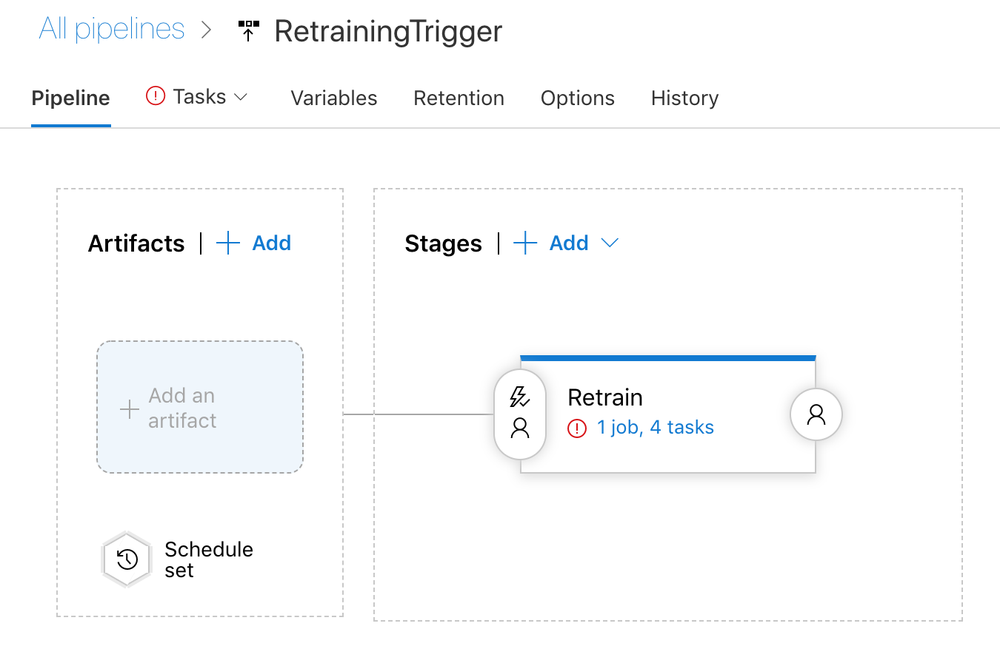

    Click on agent job and then from the drop down for Agent Pool on the right side select **Hosted Ubuntu 1604** agent to execute your run and click **Save** button on top right.
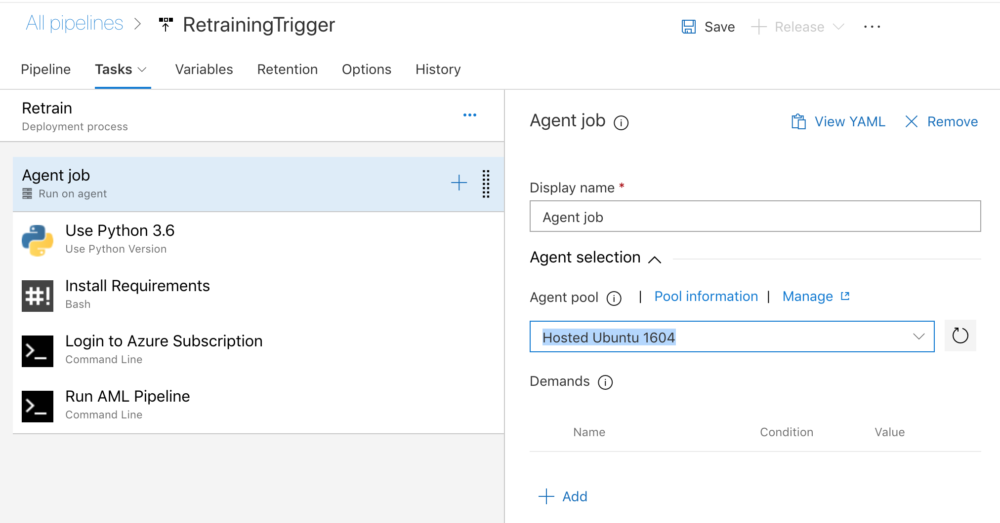

1. We would now link the variable group we created earlier to this release pipeline. To do so click on the **Variables** tab, then click on **Variable** groups and then select **Link variable group** and select the variable group that we created in previous step and click **Link** followed by **Save** button.
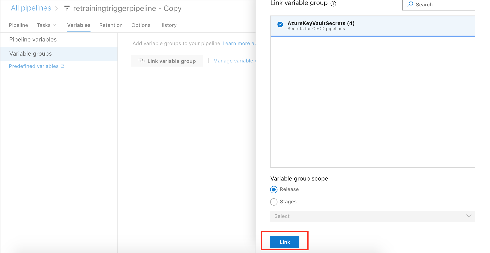
1. We want the retraining pipeline to be triggered every time build pipeline is complete. To create this dependency, we will link the artifact from build pipeline as a trigger for retraining trigger release pipeline. To do so, click on the **pipeline** tab and then select **Add an artifact** option under Artifacts.
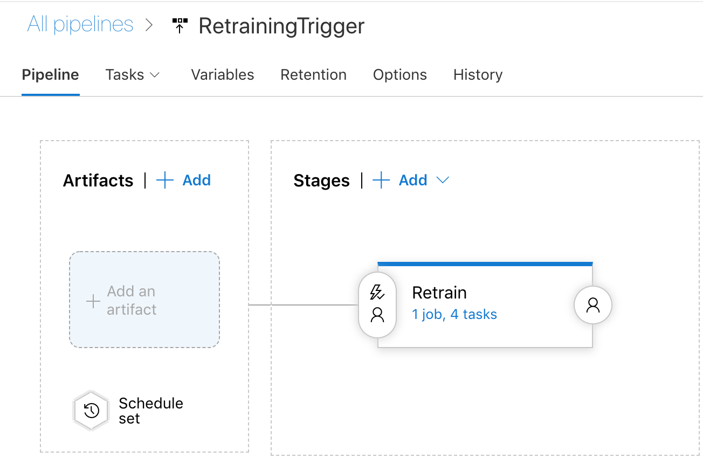

1. This will open up a pop up window, on this screen:
    - for source type, select **Build**
    - for project, select your project in Azure DevOps that you created in previous steps.
    - For Source select the source build pipeline. If you have forked the git repo, the build pipeline may named ``yourgitusername.DevOpsForAI``
    - In the Source alias, replace the auto-populated value with 
    **``DevOpsForAI``**
    - Field **Devault version** will get auto populated **Latest**, you can leave them as it is.
    - Click on **Add**, and then **Save** the pipeline
  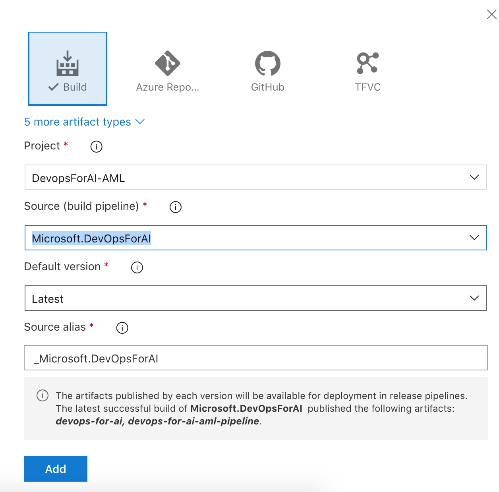

1. Artifact is now added for retraining trigger pipeline, hit the **save** button on top right and then click **ok**. 

1. To trigger this pipeline every time build pipeline executes, click on the lighting sign to enable the **Continous Deployment Trigger**, click **Save**.
    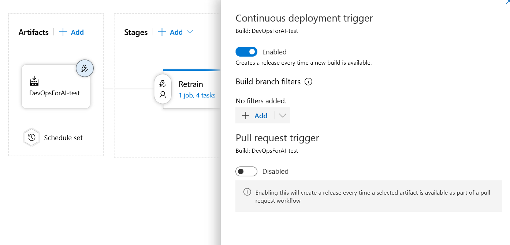
    
2. If you want to run this pipeline on a schedule, you can set one by clicking on **Schedule set** in Artifacts section.
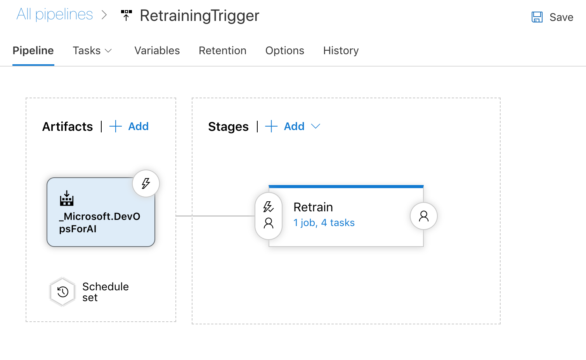

1. For the first time, we will manually trigger this pipeline.
   - Click Releases option on the left hand side and navigate to the release pipeline you just created.
  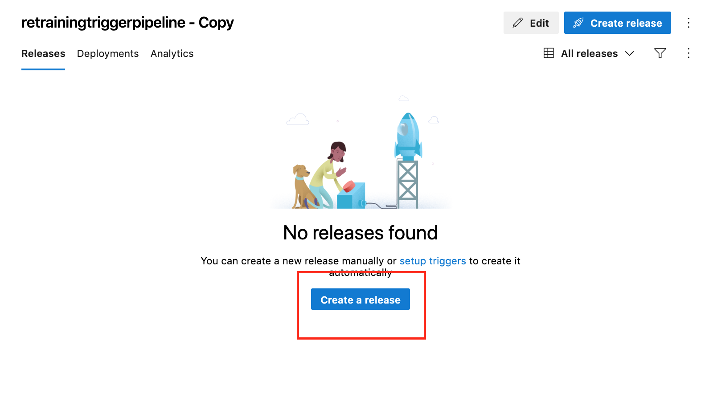
   - Click **Create Release**
  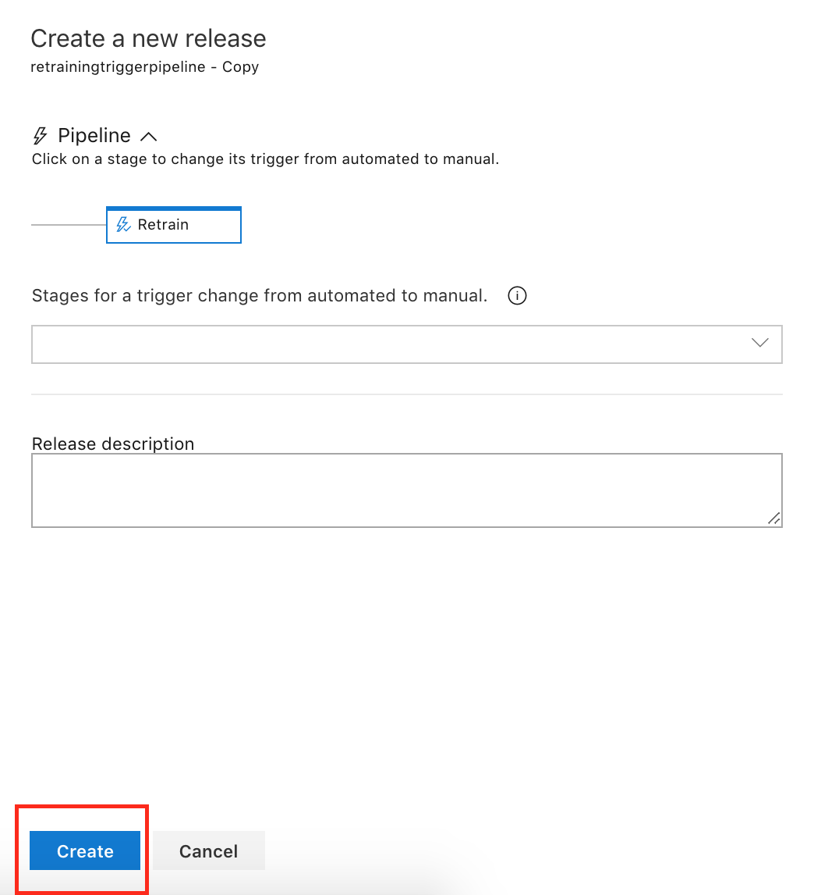
   - On the next screen click on **Create** button, this creates a manual release for you.

  **Note**: This release pipeline will call the published AML pipeline. The AML pipeline will train the model and package it into image. It will take around 10 mins to complete. The next steps need this pipeline to complete successfully.

### 7. Set up release (Deployment) pipeline

**Note:** For setting up release pipelines, first download the [release-pipelines](../release-pipelines) to your local filesystem so you can import it. 

**Also Note:** Before creating this pipeline, make sure that the build pipeline, retraining trigger release pipeline and AML retraining pipeline have been executed, as they will be creating resources during their run like docker images that we will deploy as part of this pipeline. So it is important for them to have successful runs before the setup here. 

Let's set up the release deployment pipeline now.
1. As done in previous step, Select the Release tab from the menu on the left, then click the New dropdown on top and click on **Import Release pipeline**

1. On the next screen, navigate to **release-pipelines** folder and select **releasedeployment.json** pipeline file, click import. You should now see the following screen. Under Stages click on the QA environment's **view stage task", where it shows the red error sign.
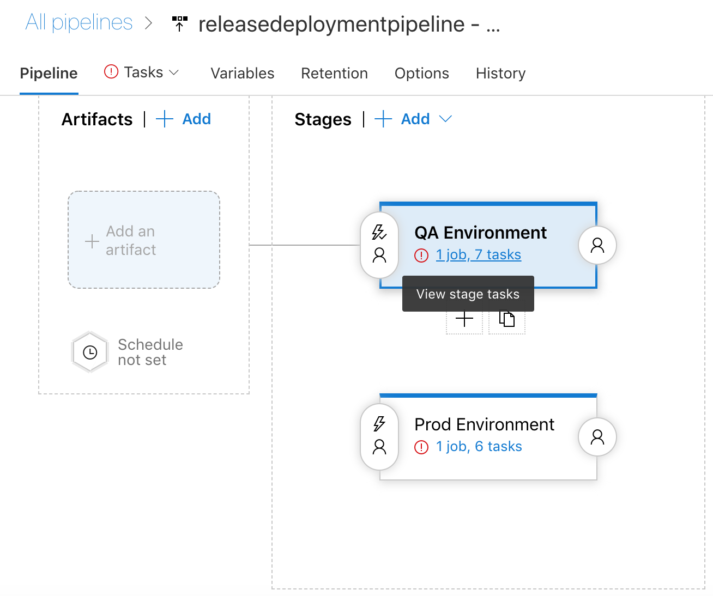

    Click on agent job and then from the drop down for Agent Pool on the right side select **Hosted Ubuntu 1604** agent to execute your run and click **Save** button on top right.
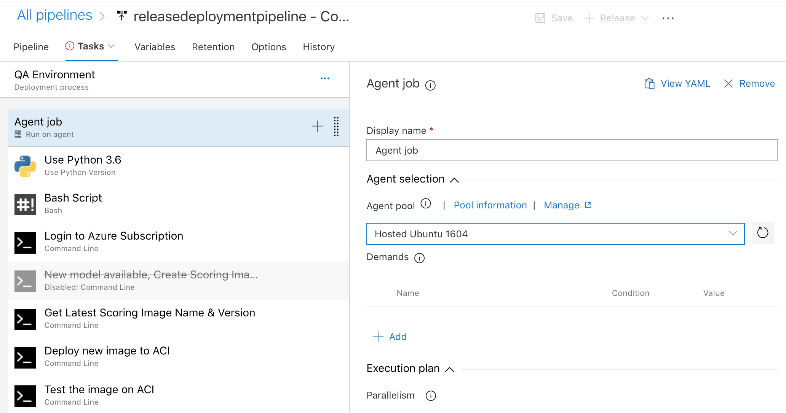

   Follow the same steps for **Prod Environment** and select **Hosted Ubuntu 1604** for agent pool and save the pipeline.
   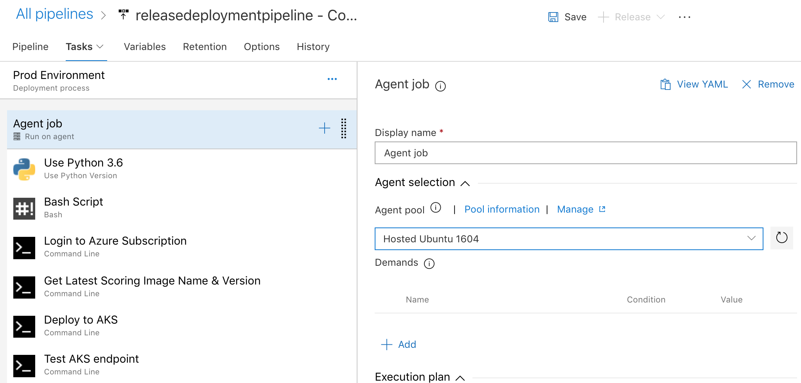

1. We would now link the variable group we created earlier to this release pipeline. To do so click on the **Variables** tab, then click on **Variable** groups and then select **Link variable group** and select the variable group that we created in previous step and click **Link** followed by **Save** button.

1. We now need to add artifact that will trigger this pipeline. We will add two artifacts:
      - Build pipeline output as artifact since that contains our configuration and code files that we require in this pipeline.
      - ACR artifact to trigger this pipeline everytime there is a new image that gets published to Azure container registry (ACR) as part of retraining pipeline. 

   Here are the steps to add build output as artifact

   - Click on pipeline tab to go back to pipeline view and click **Add an artifact**. This will open a pop up window
    - for source type, select **Build**
    - for project, select your project in Azure DevOps that you created in previous steps.
    - For Source select the source build pipeline. If you have forked the git repo, the build pipeline may named ``yourgitusername.DevOpsForAI``
    - In the Source alias, replace the auto-populated value with 
    **``DevOpsForAI``**
    - Field **Devault version** will get auto populated **Latest**, you can leave them as it is.
    - Click on **Add**, and then **Save** the pipeline
  

   Here are the steps to add ACR as an artifact

   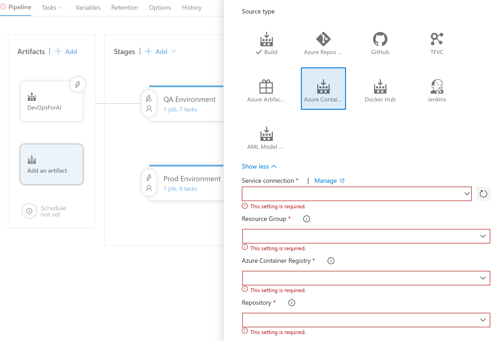
   
   
    - Click on pipeline tab to go back to pipeline view and click **Add an artifact**. This will open a pop up window
    - For Source type, click on **more artifact types** dropdown and select **Azure Container Registry**
    - For **service connection**, select an existing service connection to Azure, if you don't see anything in the dropdown, click on **Manage** and [create new **Azure Resource Manager**](https://docs.microsoft.com/en-us/azure/devops/pipelines/library/service-endpoints?view=azure-devops#create-a-service-connection) service connection for your subscription.
    **Note:** You must have sufficient privileges to create a service connection, if not contact your subscription adminstrator.
    - For Resource Group, select **DevOps_AzureML_Demo**, this is the default resource group name that we are using and if the previous pipelines executed properly you will see this resource group in the drop down.
    - Under Azure container registry dropdown, select the container registry, there should be only one container registry entry.
    - For repository, select **diabetes-model-score** repository.
    - For Default version, keep it to **latest**  
    - For Source alias, keep the default generated name.
    - Click Add
    - Click on lighting sign to enable the **Continous Deployment Trigger**, click Save.
    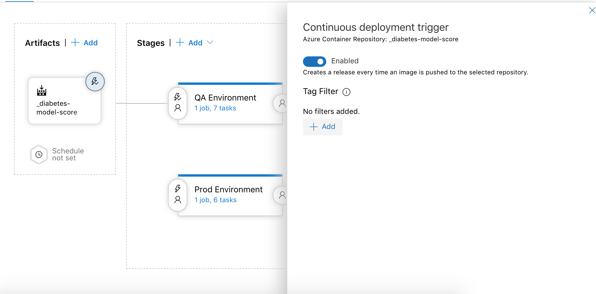

1. We now have QA environment continously deployed each time there is a new image available in container registry. You can select pre-deployment conditions for prod environment, normally you don't want it to be auto deployed, so select manual only trigger here.

    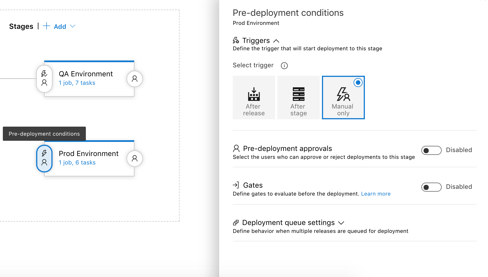

    To deploy a release manually, follow the document [here](https://docs.microsoft.com/en-us/azure/devops/pipelines/get-started-designer?view=azure-devops&tabs=new-nav#deploy-a-release)

Congratulations, you now have three pipelines set up end to end.
   - Build pipeline: triggered on code change to master branch on GitHub.
   - Release Trigger pipeline: triggered on build pipeline execution and produces a new model image if better than previous one.
   - Release Deployment pipeline: QA environment is auto triggered when there is a new image.
    Prod is manual only and user decides when to release to this environment.
