# Getting Started with MLOpsPython <!-- omit in toc -->

This guide shows how to get MLOpsPython working with a sample ML project ***diabetes_regression***. The project creates a linear regression model to predict diabetes. You can adapt this example to use with your own project.

We recommend working through this guide completely to ensure everything is working in your environment. After the sample is working, follow the [bootstrap instructions](../bootstrap/README.md) to convert the ***diabetes_regression*** sample into a starting point for your project.

- [Setting up Azure DevOps](#setting-up-azure-devops)
- [Get the code](#get-the-code)
- [Create a Variable Group for your Pipeline](#create-a-variable-group-for-your-pipeline)
  - [Variable Descriptions](#variable-descriptions)
- [Provisioning resources using Azure Pipelines](#provisioning-resources-using-azure-pipelines)
  - [Create an Azure DevOps Service Connection for the Azure Resource Manager](#create-an-azure-devops-service-connection-for-the-azure-resource-manager)
  - [Create the IaC Pipeline](#create-the-iac-pipeline)
- [Create an Azure DevOps Service Connection for the Azure ML Workspace](#create-an-azure-devops-service-connection-for-the-azure-ml-workspace)
- [Set up Build, Release Trigger, and Release Multi-Stage Pipeline](#set-up-build-release-trigger-and-release-multi-stage-pipeline)
  - [Set up the Pipeline](#set-up-the-pipeline)
- [Further Exploration](#further-exploration)
  - [Deploy the model to Azure Kubernetes Service](#deploy-the-model-to-azure-kubernetes-service)
    - [Web Service Authentication on Azure Kubernetes Service](#web-service-authentication-on-azure-kubernetes-service)
  - [Deploy the model to Azure App Service (Azure Web App for containers)](#deploy-the-model-to-azure-app-service-azure-web-app-for-containers)
  - [Example pipelines using R](#example-pipelines-using-r)
  - [Observability and Monitoring](#observability-and-monitoring)
  - [Clean up the example resources](#clean-up-the-example-resources)
- [Next Steps: Integrating your project](#next-steps-integrating-your-project)
  - [Additional Variables and Configuration](#additional-variables-and-configuration)
    - [More variable options](#more-variable-options)
    - [Local configuration](#local-configuration)

## Setting up Azure DevOps

You'll use Azure DevOps for running the multi-stage pipeline with build, model training, and scoring service release stages. If you don't already have an Azure DevOps organization, create one by following the instructions at [Quickstart: Create an organization or project collection](https://docs.microsoft.com/en-us/azure/devops/organizations/accounts/create-organization?view=azure-devops).

If you already have an Azure DevOps organization, create a new project using the guide at [Create a project in Azure DevOps and TFS](https://docs.microsoft.com/en-us/azure/devops/organizations/projects/create-project?view=azure-devops).

## Get the code

We recommend using the [repository template](https://github.com/microsoft/MLOpsPython/generate), which effectively forks the repository to your own GitHub location and squashes the history. You can use the resulting repository for this guide and for your own experimentation.

## Create a Variable Group for your Pipeline

MLOpsPython requires some variables to be set before you can run any pipelines. You'll need to create a *variable group* in Azure DevOps to store values that are reused across multiple pipelines or pipeline stages. Either store the values directly in [Azure DevOps](https://docs.microsoft.com/en-us/azure/devops/pipelines/library/variable-groups?view=azure-devops&tabs=designer#create-a-variable-group) or connect to an Azure Key Vault in your subscription. Check out the [Add & use variable groups](https://docs.microsoft.com/en-us/azure/devops/pipelines/library/variable-groups?view=azure-devops&tabs=yaml#use-a-variable-group) documentation to learn more about how to create a variable group and link it to your pipeline.

Navigate to **Library** in the **Pipelines** section as indicated below:

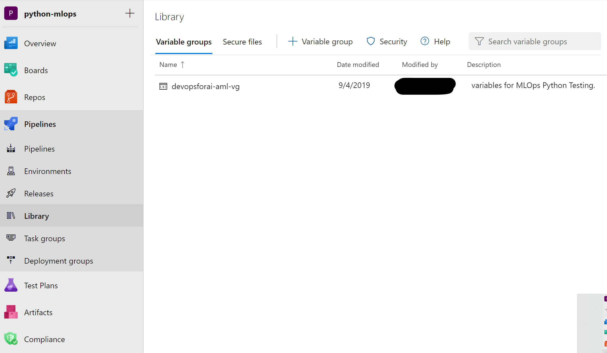

Create a variable group named **``devopsforai-aml-vg``**. The YAML pipeline definitions in this repository refer to this variable group by name.

The variable group should contain the following required variables. **Azure resources that don't exist yet will be created in the [Provisioning resources using Azure Pipelines](#provisioning-resources-using-azure-pipelines) step below.**

| Variable Name            | Suggested Value           | Short description                                                                                                           |
| ------------------------ | ------------------------- | --------------------------------------------------------------------------------------------------------------------------- |
| BASE_NAME                | [your project name]       | Unique naming prefix for created resources - max 10 chars, letters and numbers only                                         |
| LOCATION                 | centralus                 | [Azure location](https://azure.microsoft.com/en-us/global-infrastructure/locations/), no spaces                             |
| RESOURCE_GROUP           | mlops-RG                  | Azure Resource Group name                                                                                                   |
| WORKSPACE_NAME           | mlops-AML-WS              | Azure ML Workspace name                                                                                                     |
| AZURE_RM_SVC_CONNECTION  | azure-resource-connection | [Azure Resource Manager Service Connection](#create-an-azure-devops-service-connection-for-the-azure-resource-manager) name |
| WORKSPACE_SVC_CONNECTION | aml-workspace-connection  | [Azure ML Workspace Service Connection](#create-an-azure-devops-azure-ml-workspace-service-connection) name                 |
| ACI_DEPLOYMENT_NAME      | mlops-aci                 | [Azure Container Instances](https://azure.microsoft.com/en-us/services/container-instances/) name                           |

Make sure you select the **Allow access to all pipelines** checkbox in the variable group configuration.

More variables are available for further tweaking, but the above variables are all you need to get started with this example. For more information, see the [Additional Variables and Configuration](#additional-variables-and-configuration) section.

### Variable Descriptions

**BASE_NAME** is used as a prefix for naming Azure resources. When sharing an Azure subscription, the prefix allows you to avoid naming collisions for resources that require unique names, for example, Azure Blob Storage and Registry DNS. Make sure to set BASE_NAME to a unique name so that created resources will have unique names, for example, MyUniqueMLamlcr, MyUniqueML-AML-KV, and so on. The length of the BASE_NAME value shouldn't exceed 10 characters and must contain letters and numbers only.

**LOCATION** is the name of the [Azure location](https://azure.microsoft.com/en-us/global-infrastructure/locations/) for your resources. There should be no spaces in the name. For example, central, westus, westus2.

**RESOURCE_GROUP** is used as the name for the resource group that will hold the Azure resources for the solution. If providing an existing Azure ML Workspace, set this value to the corresponding resource group name.

**WORKSPACE_NAME** is used for creating the Azure Machine Learning Workspace. You can provide an existing Azure ML Workspace here if you've got one.

**AZURE_RM_SVC_CONNECTION** is used by the [Azure Pipeline]((../environment_setup/iac-create-environment-pipeline.yml)) in Azure DevOps that creates the Azure ML workspace and associated resources through Azure Resource Manager. You'll create the connection in a [step below](#create-an-azure-devops-service-connection-for-the-azure-resource-manager).

**WORKSPACE_SVC_CONNECTION** is used to reference a [service connection for the Azure ML workspace](#create-an-azure-devops-azure-ml-workspace-service-connection). You'll create the connection after [provisioning the workspace](#provisioning-resources-using-azure-pipelines) in the [Create an Azure DevOps Service Connection for the Azure ML Workspace](#create-an-azure-devops-service-connection-for-the-azure-ml-workspace) section below.

**ACI_DEPLOYMENT_NAME** is used for naming the scoring service during deployment to [Azure Container Instances](https://azure.microsoft.com/en-us/services/container-instances/).

## Provisioning resources using Azure Pipelines

The easiest way to create all required Azure resources (Resource Group, Azure ML Workspace, Container Registry, and others) is to use the **Infrastructure as Code (IaC)** [pipeline with ARM templates](../environment_setup/iac-create-environment-pipeline-arm.yml) or the [pipeline with Terraform templates](../environment_setup/iac-create-environment-pipeline-tf.yml). The pipeline takes care of setting up all required resources based on these [Azure Resource Manager templates](../environment_setup/arm-templates/cloud-environment.json), or based on these [Terraform templates](../environment_setup/tf-templates).

### Create an Azure DevOps Service Connection for the Azure Resource Manager

The [IaC provisioning pipeline]((../environment_setup/iac-create-environment-pipeline.yml)) requires an **Azure Resource Manager** [service connection](https://docs.microsoft.com/en-us/azure/devops/pipelines/library/service-endpoints?view=azure-devops&tabs=yaml#create-a-service-connection).

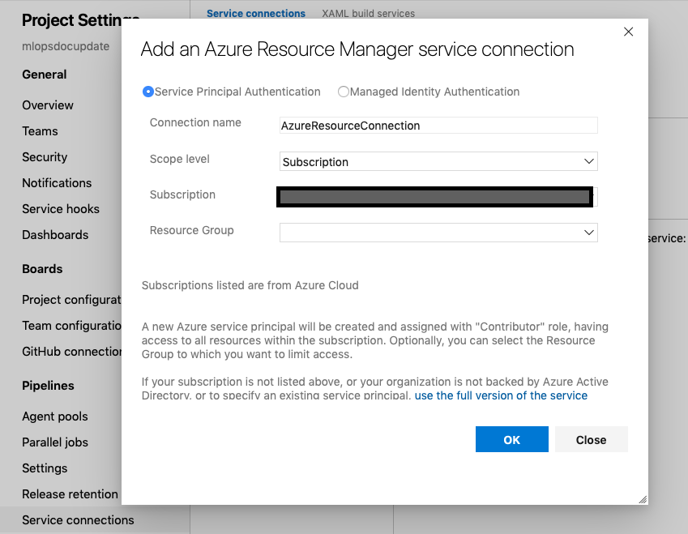

Leave the **``Resource Group``** field empty.

**Note:** Creating the Azure Resource Manager service connection scope requires 'Owner' or 'User Access Administrator' permissions on the subscription.
You'll also need sufficient permissions to register an application with your Azure AD tenant, or you can get the ID and secret of a service principal from your Azure AD Administrator. That principal must have 'Contributor' permissions on the subscription.

### Create the IaC Pipeline

In your Azure DevOps project, create a build pipeline from your forked repository:

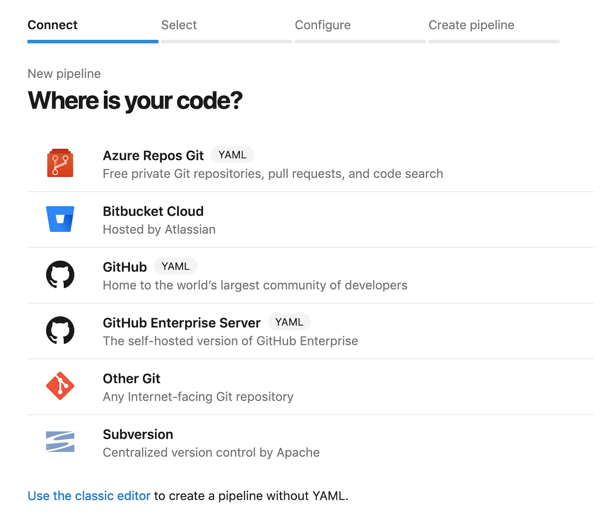

Select the **Existing Azure Pipelines YAML file** option and set the path to [/environment_setup/iac-create-environment-pipeline-arm.yml](../environment_setup/iac-create-environment-pipeline-arm.yml) or to [/environment_setup/iac-create-environment-pipeline-tf.yml](../environment_setup/iac-create-environment-pipeline-tf.yml), depending on if you want to deploy your infrastructure using ARM templates or Terraform:

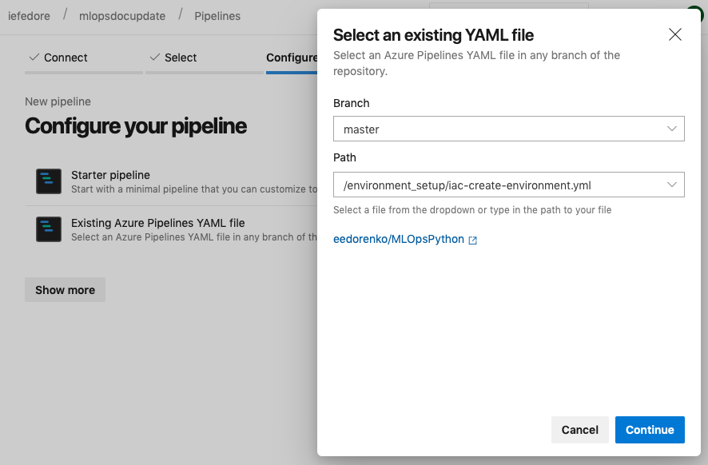

If you decide to use Terraform, make sure the ['Terraform Build & Release Tasks' from Charles Zipp](https://marketplace.visualstudio.com/items?itemName=charleszipp.azure-pipelines-tasks-terraform) is installed.

Having done that, run the pipeline:

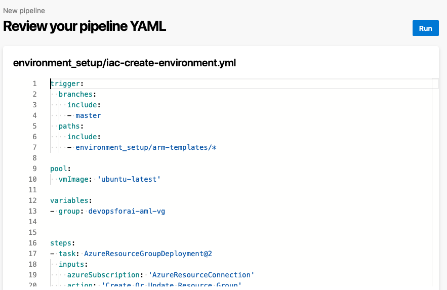

Check that the newly created resources appear in the [Azure Portal](https://portal.azure.com):

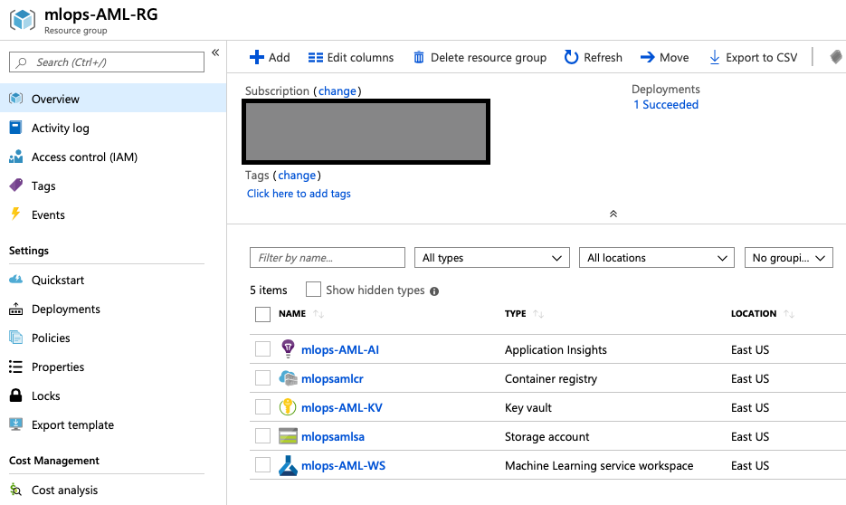

## Create an Azure DevOps Service Connection for the Azure ML Workspace

At this point, you should have an Azure ML Workspace created. Similar to the Azure Resource Manager service connection, you need to create an additional one for the Azure ML Workspace.

Install the **Azure Machine Learning** extension to your Azure DevOps organization from the [Visual Studio Marketplace](https://marketplace.visualstudio.com/items?itemName=ms-air-aiagility.vss-services-azureml). The extension is required for the service connection.

Create a new service connection to your Azure ML Workspace using the [Machine Learning Extension](https://marketplace.visualstudio.com/items?itemName=ms-air-aiagility.vss-services-azureml) instructions to enable executing the Azure ML training pipeline. The connection name needs to match `WORKSPACE_SVC_CONNECTION` that you set in the variable group above.

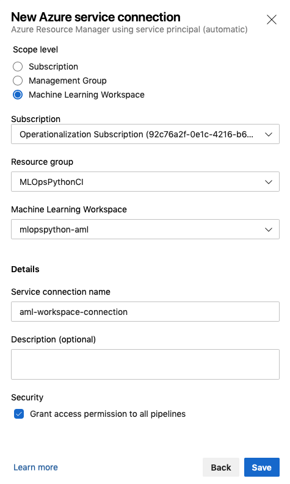

**Note:** Similar to the Azure Resource Manager service connection you created earlier, creating a service connection with Azure Machine Learning workspace scope requires 'Owner' or 'User Access Administrator' permissions on the Workspace.
You'll need sufficient permissions to register an application with your Azure AD tenant, or you can get the ID and secret of a service principal from your Azure AD Administrator. That principal must have Contributor permissions on the Azure ML Workspace.

## Set up Build, Release Trigger, and Release Multi-Stage Pipeline

Now that you've provisioned all the required Azure resources and service connections, you can set up the pipeline for deploying your machine learning model to production. The pipeline has a sequence of stages for:

1. **Model Code Continuous Integration:** triggered on code changes to master branch on GitHub. Runs linting, unit tests, code coverage and publishes a training pipeline.
1. **Train Model**: invokes the Azure ML service to trigger the published training pipeline to train, evaluate, and register a model.
1. **Release Deployment:** deploys a model to either [Azure Container Instances (ACI)](https://azure.microsoft.com/en-us/services/container-instances/), [Azure Kubernetes Service (AKS)](https://azure.microsoft.com/en-us/services/kubernetes-service), or [Azure App Service](https://docs.microsoft.com/en-us/azure/machine-learning/service/how-to-deploy-app-service) environments. For simplicity, you're going to initially focus on Azure Container Instances. See [Further Exploration](#further-exploration) for other deployment types.
   1. **Note:** Edit the pipeline definition to remove unused stages. For example, if you're deploying to Azure Container Instances and Azure Kubernetes Service only, delete the unused `Deploy_Webapp` stage.

### Set up the Pipeline

In your Azure DevOps project, create and run a new build pipeline based on the  [diabetes_regression-ci.yml](../.pipelines/diabetes_regression-ci.yml)
pipeline definition in your forked repository.

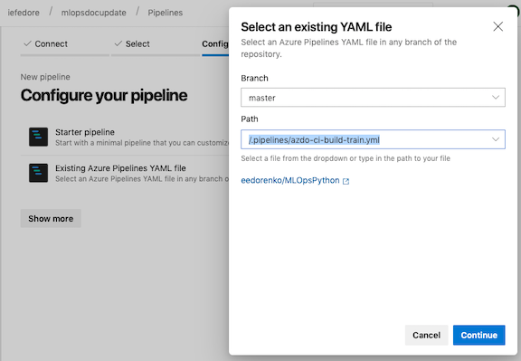

Once the pipeline is finished, check the execution result:

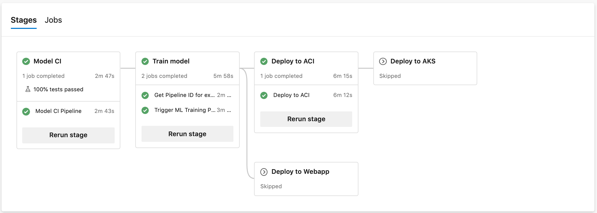

Also check the published training pipeline in the **mlops-AML-WS** workspace in [Azure Portal](https://portal.azure.com/):

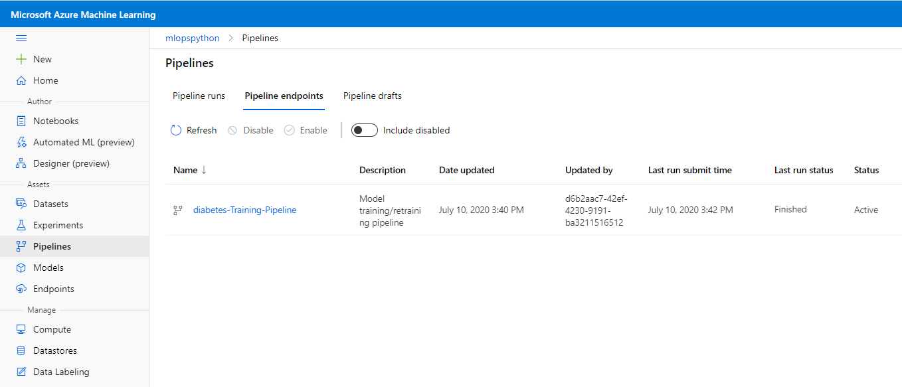

Great, you now have the build pipeline set up which automatically triggers every time there's a change in the master branch!

The pipeline stages are summarized below:

#### Model CI

- Linting (code quality analysis)
- Unit tests and code coverage analysis
- Build and publish *ML Training Pipeline* in an *ML Workspace*

#### Train model

- Determine the ID of the *ML Training Pipeline* published in the previous stage.
- Trigger the *ML Training Pipeline* and waits for it to complete.
  - This is an **agentless** job. The CI pipeline can wait for ML pipeline completion for hours or even days without using agent resources.
- Determine if a new model was registered by the *ML Training Pipeline*.
  - If the model evaluation determines that the new model doesn't perform any better than the previous one, the new model won't register and the *ML Training Pipeline* will be **canceled**. In this case, you'll see a message in the 'Train Model' job under the 'Determine if evaluation succeeded and new model is registered' step saying '**Model was not registered for this run.**'
  - See [evaluate_model.py](../diabetes_regression/evaluate/evaluate_model.py#L118) for the evaluation logic and [diabetes_regression_verify_train_pipeline.py](../ml_service/pipelines/diabetes_regression_verify_train_pipeline.py#L54) for the ML pipeline reporting logic.
  - [Additional Variables and Configuration](#additional-variables-and-configuration) for configuring this and other behavior.

#### Deploy to ACI

- Deploy the model to the QA environment in [Azure Container Instances](https://azure.microsoft.com/en-us/services/container-instances/).
- Smoke test
  - The test sends a sample query to the scoring web service and verifies that it returns the expected response. Have a look at the [smoke test code](../ml_service/util/smoke_test_scoring_service.py) for an example.

The pipeline uses a Docker container on the Azure Pipelines agents to accomplish the pipeline steps. The container image ***mcr.microsoft.com/mlops/python:latest*** is built with [this Dockerfile](../environment_setup/Dockerfile) and has all the necessary dependencies installed for MLOpsPython and ***diabetes_regression***. This image is an example of a custom Docker image with a pre-baked environment. The environment is guaranteed to be the same on any building agent, VM, or local machine. In your project, you'll want to build your own Docker image that only contains the dependencies and tools required for your use case. Your image will probably be smaller and faster, and it will be maintained by your team.

After the pipeline is finished, you'll see a new model in the **ML Workspace**:

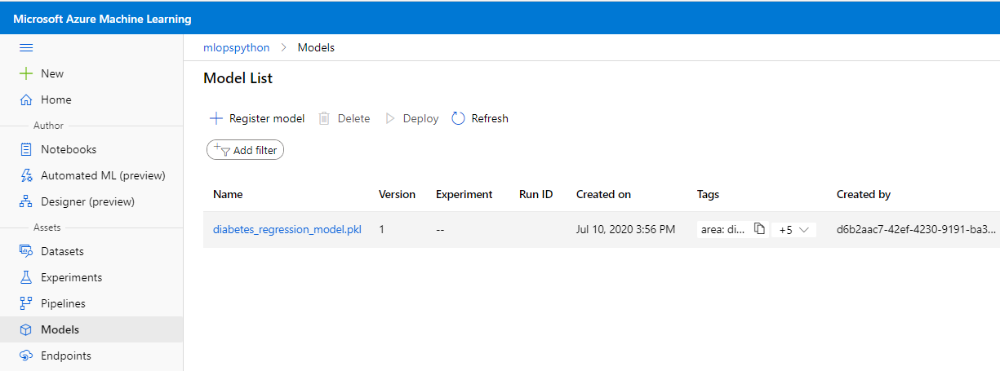

To disable the automatic trigger of the training pipeline, change the `auto-trigger-training` variable as listed in the `.pipelines\diabetes_regression-ci.yml` pipeline to `false`.  You can also override the variable at runtime execution of the pipeline.

To skip model training and registration, and deploy a model successfully registered by a previous build (for testing changes to the score file or inference configuration), add the variable `MODEL_BUILD_ID` when the pipeline is queued, and set the value to the ID of the previous build.

## Further Exploration

You should now have a working pipeline that can get you started with MLOpsPython. Below are some additional features offered that might suit your scenario.

### Deploy the model to Azure Kubernetes Service

MLOpsPython also can deploy to [Azure Kubernetes Service](https://azure.microsoft.com/en-us/services/kubernetes-service).

Creating a cluster on Azure Kubernetes Service is out of scope of this tutorial, but you can find set up information on the [Quickstart: Deploy an Azure Kubernetes Service (AKS) cluster using the Azure portal](https://docs.microsoft.com/en-us/azure/aks/kubernetes-walkthrough-portal#create-an-aks-cluster) page.

**Note:** If your target deployment environment is a Kubernetes cluster and you want to implement Canary and/or A/B testing deployment strategies, check out this [tutorial](./canary_ab_deployment.md).

Keep the Azure Container Instances deployment active because it's a lightweight way to validate changes before deploying to Azure Kubernetes Service.

In the Variables tab, edit your variable group (`devopsforai-aml-vg`). In the variable group definition, add these variables:

| Variable Name       | Suggested Value |
| ------------------- | --------------- |
| AKS_COMPUTE_NAME    | aks             |
| AKS_DEPLOYMENT_NAME | mlops-aks       |

Set **AKS_COMPUTE_NAME** to the *Compute name* of the Inference Cluster that references the Azure Kubernetes Service cluster in your Azure ML Workspace.

After successfully deploying to Azure Container Instances, the next stage will deploy the model to Kubernetes and run a smoke test.

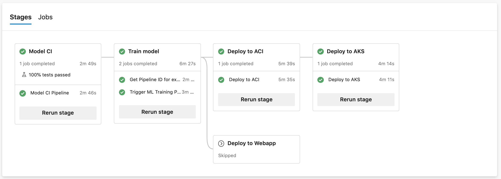

Consider enabling [manual approvals](https://docs.microsoft.com/en-us/azure/devops/pipelines/process/approvals) before the deployment stages.

#### Web Service Authentication on Azure Kubernetes Service

When deploying to Azure Kubernetes Service, key-based authentication is enabled by default. You can also enable token-based authentication. Token-based authentication requires clients to use an Azure Active Directory account to request an authentication token, which is used to make requests to the deployed service. For more details on how to authenticate with ML web service deployed on the AKS service please follow [Smoke Test](../ml_service/util/smoke_test_scoring_service.py) or the Azure documentation on [web service authentication](https://docs.microsoft.com/en-us/azure/machine-learning/how-to-deploy-azure-kubernetes-service#web-service-authentication).

### Deploy the model to Azure App Service (Azure Web App for containers)

If you want to deploy your scoring service as an [Azure App Service](https://docs.microsoft.com/en-us/azure/machine-learning/service/how-to-deploy-app-service) instead of Azure Container Instances and Azure Kubernetes Service, follow these additional steps.

In the Variables tab, edit your variable group (`devopsforai-aml-vg`) and add a variable:

| Variable Name          | Suggested Value        |
| ---------------------- | ---------------------- |
| WEBAPP_DEPLOYMENT_NAME | _name of your web app_ |

Set **WEBAPP_DEPLOYMENT_NAME** to the name of your Azure Web App. This app must exist before you can deploy the model to it.

Delete the **ACI_DEPLOYMENT_NAME** variable.

The pipeline uses the [Create Image Script](../ml_service/util/create_scoring_image.py) to create a scoring image. The image will be registered under an Azure Container Registry instance that belongs to the Azure Machine Learning Service. Any dependencies that the scoring file depends on can also be packaged with the container with an image config. Learn more about how to create a container using the Azure ML SDK with the [Image class](https://docs.microsoft.com/en-us/python/api/azureml-core/azureml.core.image.image.image?view=azure-ml-py#create-workspace--name--models--image-config-) API documentation.

Make sure your webapp has the credentials to pull the image from the Azure Container Registry created by the Infrastructure as Code pipeline. Instructions can be found on the [Configure registry credentials in web app](https://docs.microsoft.com/en-us/azure/devops/pipelines/targets/webapp-on-container-linux?view=azure-devops&tabs=dotnet-core%2Cyaml#configure-registry-credentials-in-web-app) page. You'll need to run the pipeline once (including the Deploy to Webapp stage up to the `Create scoring image` step) so an image is present in the registry. After that, you can connect the Webapp to the Azure Container Registry in the Azure Portal.

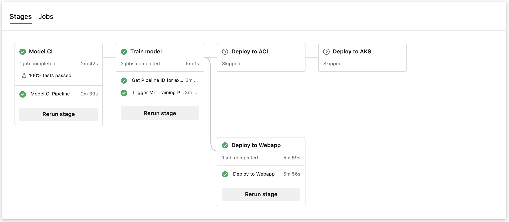

### Example pipelines using R

The build pipeline also supports building and publishing Azure ML pipelines using R to train a model. You can enable it by changing the `build-train-script` pipeline variable to either of the following values:

* `diabetes_regression_build_train_pipeline_with_r.py` to train a model with R on Azure ML Compute. You'll also need to uncomment (include) the `r-essentials` Conda packages in the environment definition YAML `diabetes_regression/conda_dependencies.yml`.
* `diabetes_regression_build_train_pipeline_with_r_on_dbricks.py` to train a model with R on Databricks. You'll need to manually create a Databricks cluster and attach it to the Azure ML Workspace as a compute resource. Set the DB_CLUSTER_ID and DATABRICKS_COMPUTE_NAME variables in your variable group.

Example ML pipelines using R have a single step to train a model. They don't demonstrate how to evaluate and register a model. The evaluation and registering techniques are shown only in the Python implementation.

### Observability and Monitoring

You can explore aspects of model observability in the solution, such as:

* **Logging**: Navigate to the Application Insights instance linked to the Azure ML Portal, then go to the Logs (Analytics) pane. The following sample query correlates HTTP requests with custom logs generated in `score.py`. This can be used, for example, to analyze query duration vs. scoring batch size:

  ```
  let Traceinfo=traces
  | extend d=parse_json(tostring(customDimensions.Content))
  | project workspace=customDimensions.["Workspace Name"],
      service=customDimensions.["Service Name"],
      NumberOfPredictions=tostring(d.NumberOfPredictions),
      id=tostring(d.RequestId),
      TraceParent=tostring(d.TraceParent);
  requests
  | project timestamp, id, success, resultCode, duration
  | join kind=fullouter Traceinfo on id
  | project-away id1
  ```

* **Distributed tracing**: The smoke test client code sets an HTTP `traceparent` header (per the [W3C Trace Context proposed specification](https://www.w3.org/TR/trace-context-1)), and the `score.py` code logs the header. The query above shows how to surface this value. You can adapt it to your tracing framework.
* **Monitoring**: You can use [Azure Monitor for containers](https://docs.microsoft.com/en-us/azure/azure-monitor/insights/container-insights-overview) to monitor the Azure ML scoring containers' performance.

### Clean up the example resources

To remove the resources created for this project, use the [/environment_setup/iac-remove-environment-pipeline.yml](../environment_setup/iac-remove-environment-pipeline.yml) definition or you can just delete the resource group in the [Azure Portal](https://portal.azure.com).

## Next Steps: Integrating your project

* The [custom model](custom_model.md) guide includes information on bringing your own code to this repository template.
* Consider using [Azure Pipelines self-hosted agents](https://docs.microsoft.com/en-us/azure/devops/pipelines/agents/agents?view=azure-devops&tabs=browser#install) to speed up your Azure ML pipeline execution. The Docker container image for the Azure ML pipeline is sizable, and having it cached on the agent between runs can trim several minutes from your runs.

### Additional Variables and Configuration

#### More variable options

There are more variables used in the project. They're defined in two places: one for local execution and one for using Azure DevOps Pipelines.

For using Azure Pipelines, all other variables are stored in the file `.pipelines/diabetes_regression-variables-template.yml`. Using the default values as a starting point, adjust the variables to suit your requirements.

In that folder, you'll also find the `parameters.json` file that we recommend using to provide parameters for training, evaluation, and scoring scripts. The sample parameter that `diabetes_regression` uses is the ridge regression [*alpha* hyperparameter](https://scikit-learn.org/stable/modules/generated/sklearn.linear_model.Ridge.html). We don't provide any serializers for this config file.

#### Local configuration

For instructions on how to set up a local development environment, refer to the [Development environment setup instructions](development_setup.md).
