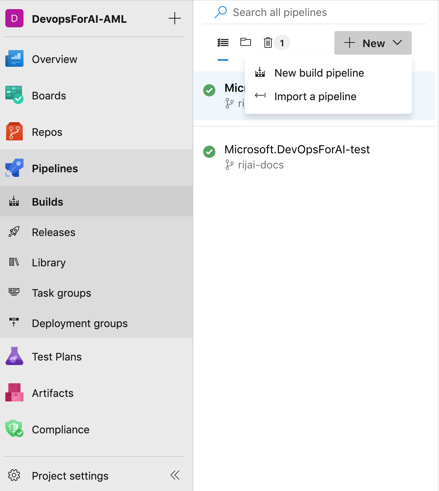

## Getting Started with this Repo

### 1. Get the source code
- Either clone the repository to your workspace and create your own repo with the code in GitHub.
- An easier way is to just fork the project, so you have the repoitory under your username on GitHub itslef.

### 2. Create Azure DevOps account
We use Azure DevOps for running our build(CI), retraining trigger and release (CD) pipelines. If you don't already have Azure DevOps account, create one by following the instructions [here](https://docs.microsoft.com/en-us/azure/devops/organizations/accounts/create-organization?view=azure-devops)

If you already have Azure DevOps account, create a new project.

**Note:** Make sure you have the right permissions in Azure DevOps to do so.

### 3. Create Service Principal to Login to Azure and create resources

To create service principal, register an application entity in Azure Active Directory (Azure AD) and grant it the Contributor or Owner role of the subscription or the resource group where the web service belongs to. See [how to create service principal](https://docs.microsoft.com/en-us/azure/active-directory/develop/howto-create-service-principal-portal) and assign permissions to manage Azure resource.
Please make note the following values after creating a service principal, we will need them in subsequent steps
- Azure subscription id (subscriptionid)
- Service principal username (spidentity)(application id)
- Service principal password (spsecret) (auth_key)
- Service principal tenant id (sptenant)
- 

**Note:** You must have sufficient permissions to register an application with your Azure AD tenant, and assign the application to a role in your Azure subscription. Contact your subscription adminstator if you don't have the permissions. Normally a subscription admin can create a Service principal and can provide you the details.

### 4. Store secret in Key Vault and link it as variable group in Azure DevOps to be used by piplines.
Our pipeline require the following variables to autheticate with Azure.
- spidentity 
- spsecret
- sptenant
- subscriptionid

We noted the value of these variables in previous steps.

**NOTE:** These values should be treated as secret as they allow access to your subscription. 

We make use of variable group inside Azure DevOps to store variables and their values that we want to make available across multiple pipelines. You can either store the values directly here or connect to an Azure Key Vault in your subscription. Please refer to the documentation [here](https://docs.microsoft.com/en-us/azure/devops/pipelines/library/variable-groups?view=azure-devops&tabs=yaml#link-secrets-from-an-azure-key-vault) to learn more about how to create a variable group and [link](https://docs.microsoft.com/en-us/azure/devops/pipelines/library/variable-groups?view=azure-devops&tabs=designer#link-secrets-from-an-azure-key-vault) it to your pipeline.
 
Please name your variable group **AzureKeyVaultSecrets**, we are using this name within our build yaml file. 

Up until now you shouls have 
- forked (or cloned) the repo, 
- created a devops account or use an existing one
-  got service principal details and subscription id.
-  set them as variable group within devops.

We now have 3 pipelines that we would set up
- Build Pipeline (azure-pipelines.yml): Runs tests and sets up infrastructure 
- Retraining trigger pipeline(/template/retraining-template.json): This pipeline submits a pipeline job to Azure ML Pipelines and trains a new model and publishes image, if new model is better after evaluation.
- Release pipeline(/template/release-template.json) : This pipeline releases our image and deploys it to QA and Prod environment.

### 5. Set up Build Pipeline
1. Select your devops organization and project by clicking dev.azure.com
2. Once you are in the right devops project, click Pipelines on the left hand menu and select Builds
3. In the Build Menu, click **New** dropdown and then select **New build pipeline**
      
4. Select Connect and link to your GitHub repository where you cloned this repo.
   

### 6. Set up Retraining trigger release pipeline

### 7. Set up release (Deployment) pipeline

### Testing end to end flow

Now you have all the pipelines setup, each time you make a commit to the repository the following should happen automatically for first time

- build pipeline should run tests for you and set up the infrastructure (Azure ML workspace, Azure ML pipeline)
- A new retraining job will be triggered on Azure ML pipelines, you can view this job by going to portal.azure.com > your AML workspace > and then pipelines tab.
- A new docker image will get deployed to Azure container instance and prod deployment to AKS will also be created but won't be triggered.
