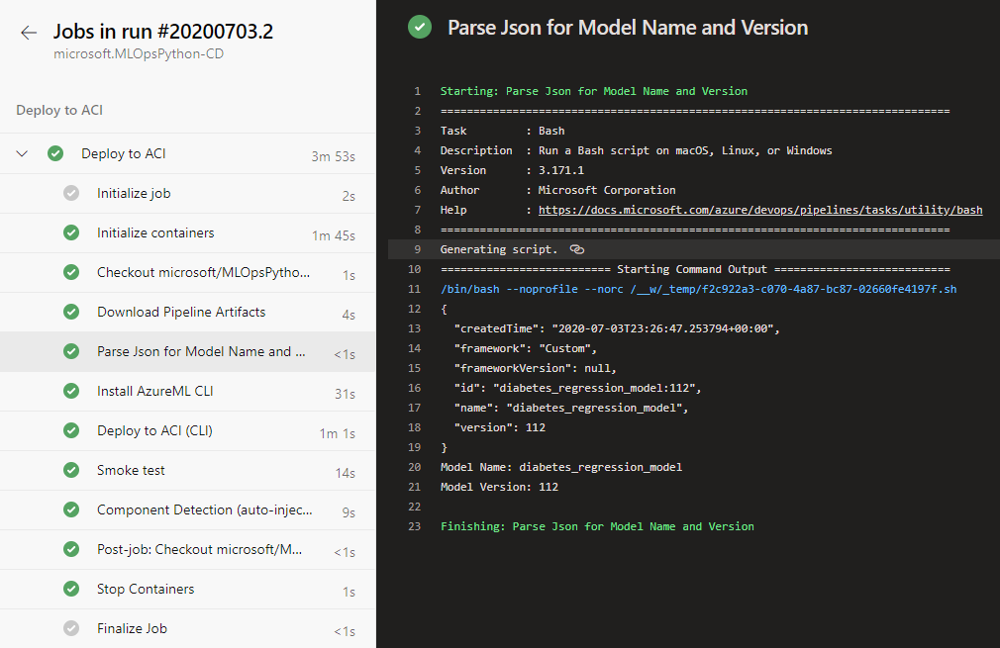
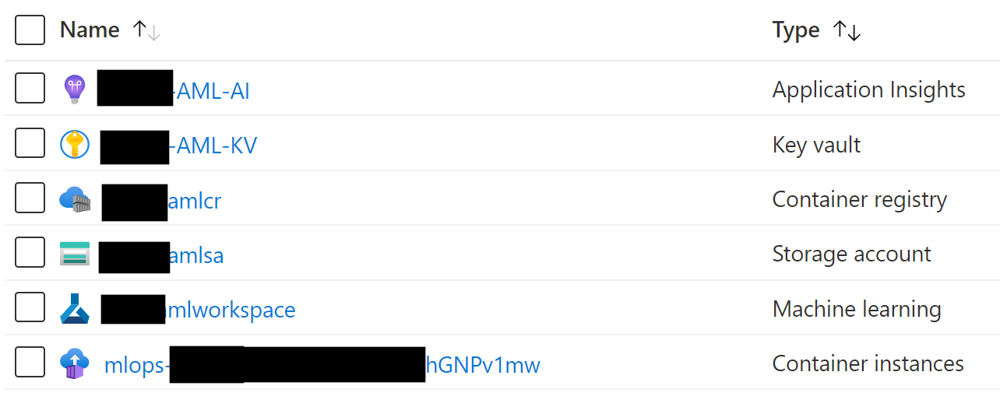
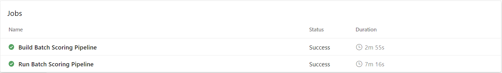
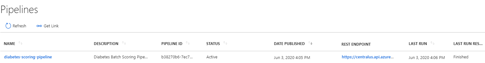
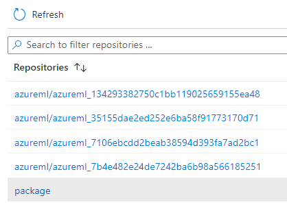
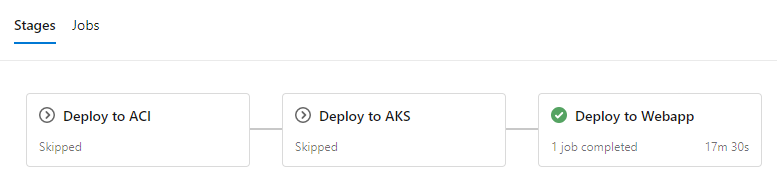
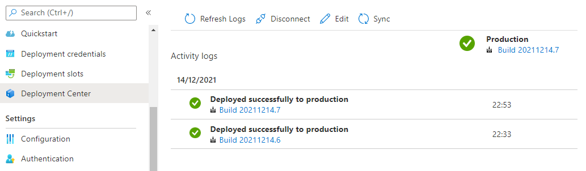

# Getting Started with MLOpsPython <!-- omit in toc -->

This guide shows how to get MLOpsPython working with a sample ML project **_diabetes_regression_**. The project creates a linear regression model to predict diabetes and has CI/CD DevOps practices enabled for model training and serving when these steps are completed in this getting started guide.

If you would like to bring your own model code to use this template structure, follow the [custom model](custom_model.md) guide. We recommend completing this getting started guide with the diabetes model through ACI deployment first to ensure everything is working in your environment before converting the template to use your own model code.

- [Setting up Azure DevOps](#setting-up-azure-devops)
  - [Install the Azure Machine Learning extension](#install-the-azure-machine-learning-extension)
- [Get the code](#get-the-code)
- [Create a Variable Group for your Pipeline](#create-a-variable-group-for-your-pipeline)
  - [Variable Descriptions](#variable-descriptions)
- [Provisioning resources using Azure Pipelines](#provisioning-resources-using-azure-pipelines)
  - [Create an Azure DevOps Service Connection for the Azure Resource Manager](#create-an-azure-devops-service-connection-for-the-azure-resource-manager)
  - [Create the IaC Pipeline](#create-the-iac-pipeline)
- [Create an Azure DevOps Service Connection for the Azure ML Workspace](#create-an-azure-devops-service-connection-for-the-azure-ml-workspace)
- [Set up Build, Release Trigger, and Release Multi-Stage Pipeline](#set-up-build-release-trigger-and-release-multi-stage-pipelines)
  - [Set up the Model CI Training, Evaluation, and Registration Pipeline](#set-up-the-model-ci-training-evaluation-and-registration-pipeline)
  - [Set up the Release Deployment and/or Batch Scoring Pipelines](#set-up-the-release-deployment-andor-batch-scoring-pipelines)
- [Further Exploration](#further-exploration)
  - [Deploy the model to Azure Kubernetes Service](#deploy-the-model-to-azure-kubernetes-service)
    - [Web Service Authentication on Azure Kubernetes Service](#web-service-authentication-on-azure-kubernetes-service)
  - [Deploy the model to Azure App Service (Azure Web App for containers)](#deploy-the-model-to-azure-app-service-azure-web-app-for-containers)
  - [Example pipelines using R](#example-pipelines-using-r)
  - [Observability and Monitoring](#observability-and-monitoring)
  - [Clean up the example resources](#clean-up-the-example-resources)
- [Next Steps: Integrating your project](#next-steps-integrating-your-project)
  - [Additional Variables and Configuration](#additional-variables-and-configuration)
    - [More variable options](#more-variable-options)
    - [Local configuration](#local-configuration)

## Setting up Azure DevOps

You'll use Azure DevOps for running the multi-stage pipeline with build, model training, and scoring service release stages. If you don't already have an Azure DevOps organization, create one by following the instructions at [Quickstart: Create an organization or project collection](https://docs.microsoft.com/en-us/azure/devops/organizations/accounts/create-organization?view=azure-devops).

If you already have an Azure DevOps organization, create a new project using the guide at [Create a project in Azure DevOps and TFS](https://docs.microsoft.com/en-us/azure/devops/organizations/projects/create-project?view=azure-devops).

### Install the Azure Machine Learning extension

Install the **Azure Machine Learning** extension to your Azure DevOps organization from the [Visual Studio Marketplace](https://marketplace.visualstudio.com/items?itemName=ms-air-aiagility.vss-services-azureml) by clicking "Get it free" and following the steps. The UI will tell you if try to add it and it's already installed. 

This extension contains the Azure ML pipeline tasks and adds the ability to create Azure ML Workspace service connections. The documentation page on the marketplace includes detailed instructions with screenshots on what capabilities it includes.

## Get the code

We recommend using the [repository template](https://github.com/microsoft/MLOpsPython/generate), which effectively forks this repository to your own GitHub location and squashes the history. You can use the resulting repository for this guide and for your own experimentation.

## Create a Variable Group for your Pipeline

MLOpsPython requires some variables to be set before you can run any pipelines. You'll need to create a _variable group_ in Azure DevOps to store values that are reused across multiple pipelines or pipeline stages. Either store the values directly in [Azure DevOps](https://docs.microsoft.com/en-us/azure/devops/pipelines/library/variable-groups?view=azure-devops&tabs=designer#create-a-variable-group) or connect to an Azure Key Vault in your subscription. Check out the [Add & use variable groups](https://docs.microsoft.com/en-us/azure/devops/pipelines/library/variable-groups?view=azure-devops&tabs=yaml#use-a-variable-group) documentation to learn more about how to create a variable group and link it to your pipeline.

Navigate to **Library** in the **Pipelines** section as indicated below:


Create a variable group named **`devopsforai-aml-vg`**. The YAML pipeline definitions in this repository refer to this variable group by name.

The variable group should contain the following required variables. **Azure resources that don't exist yet will be created in the [Provisioning resources using Azure Pipelines](#provisioning-resources-using-azure-pipelines) step below.**

| Variable Name            | Suggested Value           | Short description                                                                                                           |
| ------------------------ | ------------------------- | --------------------------------------------------------------------------------------------------------------------------- |
| BASE_NAME                | [your project name]       | Unique naming prefix for created resources - max 10 chars, letters and numbers only                                         |
| LOCATION                 | centralus                 | [Azure location](https://azure.microsoft.com/en-us/global-infrastructure/locations/), no spaces. You can list all the region codes by running `az account list-locations -o table` in the Azure CLI |
| RESOURCE_GROUP           | mlops-RG                  | Azure Resource Group name                                                                                                   |
| WORKSPACE_NAME           | mlops-AML-WS              | Azure ML Workspace name                                                                                                     |
| AZURE_RM_SVC_CONNECTION  | azure-resource-connection | [Azure Resource Manager Service Connection](#create-an-azure-devops-service-connection-for-the-azure-resource-manager) name |
| WORKSPACE_SVC_CONNECTION | aml-workspace-connection  | [Azure ML Workspace Service Connection](#create-an-azure-devops-azure-ml-workspace-service-connection) name                 |
| ACI_DEPLOYMENT_NAME      | mlops-aci                 | [Azure Container Instances](https://azure.microsoft.com/en-us/services/container-instances/) name                           |                 |

Make sure you select the **Allow access to all pipelines** checkbox in the variable group configuration. To do this, first **Save** the variable group, then click **Pipeline Permissions**, then the button with 3 vertical dots, and then **Open access** button.

More variables are available for further tweaking, but the above variables are all you need to get started with this example. For more information, see the [Additional Variables and Configuration](#additional-variables-and-configuration) section.

### Variable Descriptions

**BASE_NAME** is used as a prefix for naming Azure resources and should be unique. When sharing an Azure subscription, the prefix allows you to avoid naming collisions for resources that require unique names, for example, Azure Blob Storage and Registry DNS. Make sure to set BASE_NAME to a unique name so that created resources will have unique names, for example, MyUniqueMLamlcr, MyUniqueML-AML-KV, and so on. The length of the BASE_NAME value shouldn't exceed 10 characters and must contain letters and numbers only.

**LOCATION** is the name of the [Azure location](https://azure.microsoft.com/en-us/global-infrastructure/locations/) for your resources. There should be no spaces in the name. For example, central, westus, northeurope. You can list all the region codes by running `az account list-locations -o table` in the Azure CLI.

**RESOURCE_GROUP** is used as the name for the resource group that will hold the Azure resources for the solution. If providing an existing Azure ML Workspace, set this value to the corresponding resource group name.

**WORKSPACE_NAME** is used for creating the Azure Machine Learning Workspace. *While you should be able to provide an existing Azure ML Workspace if you have one, you will run into problems if this has been provisioned manually and the naming of the associated storage account doesn't follow the convention followed in this repo -- as the environment provisioning will try to associate it with a new Storage Account and this is not supported. To avoid these problems, specify a new workspace/unique name.*

**AZURE_RM_SVC_CONNECTION** is used by the [Azure Pipeline](../environment_setup/iac-create-environment-pipeline.yml) in Azure DevOps that creates the Azure ML workspace and associated resources through Azure Resource Manager. You'll create the connection in a [step below](#create-an-azure-devops-service-connection-for-the-azure-resource-manager).

**WORKSPACE_SVC_CONNECTION** is used to reference a [service connection for the Azure ML workspace](#create-an-azure-devops-azure-ml-workspace-service-connection). You'll create the connection after [provisioning the workspace](#provisioning-resources-using-azure-pipelines) in the [Create an Azure DevOps Service Connection for the Azure ML Workspace](#create-an-azure-devops-service-connection-for-the-azure-ml-workspace) section below.

**ACI_DEPLOYMENT_NAME** is used for naming the scoring service during deployment to [Azure Container Instances](https://azure.microsoft.com/en-us/services/container-instances/).


## Provisioning resources using Azure Pipelines

The easiest way to create all required Azure resources (Resource Group, Azure ML Workspace, Container Registry, and others) is to use the **Infrastructure as Code (IaC)** [pipeline with ARM templates](../environment_setup/iac-create-environment-pipeline-arm.yml) or the [pipeline with Terraform templates](../environment_setup/iac-create-environment-pipeline-tf.yml). The pipeline takes care of setting up all required resources based on these [Azure Resource Manager templates](../environment_setup/arm-templates/cloud-environment.json), or based on these [Terraform templates](../environment_setup/tf-templates).

**Note:** Since Azure Blob storage account required for batch scoring is optional, the resource provisioning pipelines mentioned above do not create this resource automatically, and manual creation is required before use.

### Create an Azure DevOps Service Connection for the Azure Resource Manager

The [IaC provisioning pipeline](../environment_setup/iac-create-environment-pipeline.yml) requires an **Azure Resource Manager** [service connection](https://docs.microsoft.com/en-us/azure/devops/pipelines/library/service-endpoints?view=azure-devops&tabs=yaml#create-a-service-connection). To create one, in Azure DevOps select **Project Settings**, then **Service Connections**, and create a new one, where:

- Type is **Azure Resource Manager**
- Authentication method is **Service principal (automatic)**
- Scope level is **Subscription**
- Leave **`Resource Group`** empty after selecting your subscription in the dropdown
- Use the same **`Service Connection Name`** that you used in the variable group you created
- Select **Grant access permission to all pipelines**


**Note:** Creating the Azure Resource Manager service connection scope requires 'Owner' or 'User Access Administrator' permissions on the subscription.
You'll also need sufficient permissions to register an application with your Azure AD tenant, or you can get the ID and secret of a service principal from your Azure AD Administrator. That principal must have 'Contributor' permissions on the subscription.

### Create the IaC Pipeline

In your Azure DevOps project, create a build pipeline from your forked repository:


If you are using GitHub, after picking the option above, you'll be asked to authorize to GitHub and select the repo you forked. Then you'll have to select your forked repository on GitHub under the **Repository Access** section, and click **Approve and Install**.

After the above, and when you're redirected back to Azure DevOps, select the **Existing Azure Pipelines YAML file** option and set the path to [/environment_setup/iac-create-environment-pipeline-arm.yml](../environment_setup/iac-create-environment-pipeline-arm.yml) or to [/environment_setup/iac-create-environment-pipeline-tf.yml](../environment_setup/iac-create-environment-pipeline-tf.yml), depending on if you want to deploy your infrastructure using ARM templates or Terraform:


If you decide to use Terraform, make sure the ['Terraform Build & Release Tasks' from Charles Zipp](https://marketplace.visualstudio.com/items?itemName=charleszipp.azure-pipelines-tasks-terraform) is installed.

Having done that, run the pipeline:


Check that the newly created resources appear in the [Azure Portal](https://portal.azure.com):


**Note**: If you have other errors, one good thing to check is what you used in the variable names. If you end up running the pipeline multiple times, you may also run into errors and need to delete the Azure services and re-run the pipeline -- this should include a resource group, a KeyVault, a Storage Account, a Container Registry, an Application Insights and a Machine Learning workspace.

## Create an Azure DevOps Service Connection for the Azure ML Workspace

At this point, you should have an Azure ML Workspace created. Similar to the Azure Resource Manager service connection, you need to create an additional one for the Azure ML Workspace.

Create a new service connection to your Azure ML Workspace using the [Machine Learning Extension](https://marketplace.visualstudio.com/items?itemName=ms-air-aiagility.vss-services-azureml) instructions to enable executing the Azure ML training pipeline. The connection name needs to match `WORKSPACE_SVC_CONNECTION` that you set in the variable group above (e.g., 'aml-workspace-connection').


**Note:** Similar to the Azure Resource Manager service connection you created earlier, creating a service connection with Azure Machine Learning workspace scope requires 'Owner' or 'User Access Administrator' permissions on the Workspace.
You'll need sufficient permissions to register an application with your Azure AD tenant, or you can get the ID and secret of a service principal from your Azure AD Administrator. That principal must have Contributor permissions on the Azure ML Workspace.

## Set up Build, Release Trigger, and Release Multi-Stage Pipelines

Now that you've provisioned all the required Azure resources and service connections, you can set up the pipelines for training (Continuous Integration - **CI**) and deploying (Continuous Deployment - **CD**) your machine learning model to production. Additionally, you can set up a pipeline for batch scoring.

1. **Model CI, training, evaluation, and registration** - triggered on code changes to master branch on GitHub. Runs linting, unit tests, code coverage, and publishes and runs the training pipeline. If a new model is registered after evaluation, it creates a build artifact containing the JSON metadata of the model. Definition: [diabetes_regression-ci.yml](../.pipelines/diabetes_regression-ci.yml).
1. **Release deployment** - consumes the artifact of the previous pipeline and deploys a model to either [Azure Container Instances (ACI)](https://azure.microsoft.com/en-us/services/container-instances/), [Azure Kubernetes Service (AKS)](https://azure.microsoft.com/en-us/services/kubernetes-service), or [Azure App Service](https://docs.microsoft.com/en-us/azure/machine-learning/service/how-to-deploy-app-service) environments. See [Further Exploration](#further-exploration) for other deployment types. Definition: [diabetes_regression-cd.yml](../.pipelines/diabetes_regression-cd.yml).
   1. **Note:** Edit the pipeline definition to remove unused stages. For example, if you're deploying to Azure Container Instances and Azure Kubernetes Service only, you'll need to delete the unused `Deploy_Webapp` stage.
1. **Batch Scoring Code Continuous Integration** - consumes the artifact of the model training pipeline. Runs linting, unit tests, code coverage, publishes a batch scoring pipeline, and invokes the published batch scoring pipeline to score a model.

These pipelines use a Docker container on the Azure Pipelines agents to accomplish the pipeline steps. The container image ***mcr.microsoft.com/mlops/python:latest*** is built with [this Dockerfile](../environment_setup/Dockerfile) and has all the necessary dependencies installed for MLOpsPython and ***diabetes_regression***. This image is an example of a custom Docker image with a pre-baked environment. The environment is guaranteed to be the same on any building agent, VM, or local machine. **In your project, you'll want to build your own Docker image that only contains the dependencies and tools required for your use case. Your image will probably be smaller and faster, and it will be maintained by your team.**

### Set up the Model CI, training, evaluation, and registration pipeline

In your Azure DevOps project, create and run a new build pipeline based on the [./pipelines/diabetes_regression-ci.yml](../.pipelines/diabetes_regression-ci.yml)
pipeline definition in your forked repository.

If you plan to use the release deployment pipeline (in the next section), you will need to rename this pipeline to `Model-Train-Register-CI`.

**Note**: *To rename your pipeline, after you saved it,  click **Pipelines** on the left menu on Azure DevOps, then **All** to see all the pipelines, then click the menu with the 3 vertical dots that appears when you hover the name of the new pipeline, and click it to pick **"Rename/move pipeline"**.*

Start a run of the pipeline if you haven't already, and once the pipeline is finished, check the execution result. Note that the run can take 20 minutes, with time mostly spent in **Trigger ML Training Pipeline > Invoke ML Pipeline** step. You can track the execution of the AML pipeline by opening the AML Workspace user interface. Screenshots are below:


And the pipeline artifacts:


Also check the published training pipeline in your newly created AML workspace in [Azure Machine Learning Studio](https://ml.azure.com/):


Great, you now have the build pipeline for training set up which automatically triggers every time there's a change in the master branch!

After the pipeline is finished, you'll also see a new model in the **AML Workspace** model registry section:


To disable the automatic trigger of the training pipeline, change the `auto-trigger-training` variable as listed in the `.pipelines\diabetes_regression-ci.yml` pipeline to `false`.  You can also override the variable at runtime execution of the pipeline.

The pipeline stages are summarized below:

#### Model CI

- Linting (code quality analysis)
- Unit tests and code coverage analysis
- Build and publish _ML Training Pipeline_ in an _ML Workspace_

#### Train model

- Determine the ID of the _ML Training Pipeline_ published in the previous stage.
- Trigger the _ML Training Pipeline_ and waits for it to complete.
  - This is an **agentless** job. The CI pipeline can wait for ML pipeline completion for hours or even days without using agent resources.
- Determine if a new model was registered by the _ML Training Pipeline_.
  - If the model evaluation step of the AML Pipeline determines that the new model doesn't perform any better than the previous one, the new model won't register and the _ML Training Pipeline_ will be **canceled**. In this case, you'll see a message in the 'Train Model' job under the 'Determine if evaluation succeeded and new model is registered' step saying '**Model was not registered for this run.**'
  - See [evaluate_model.py](../diabetes_regression/evaluate/evaluate_model.py#L118) for the evaluation logic. This is a simplified test that just looks at MSE to decide whether or not to register a new model. A more realistic verification would also do some error analysis and verify the inferences/error distribution against a test dataset, for example.
  - **Note**: *while it's possible to do an Evaluation Step as part of the ADO pipeline, this evaluation is logically part of the work done by Data Scientists, and as such the recommendation is that this step is done as part of the AML Pipeline and not ADO pipelines.*
  - [Additional Variables and Configuration](#additional-variables-and-configuration) for configuring this and other behavior.

#### Create pipeline artifact

- Get the info about the registered model
- Create an Azure DevOps pipeline artifact called `model` that contains a `model.json` file containing the model information, for example:

```json
{ "createdTime": "2021-12-14T13:03:24.494748+00:00", "framework": "Custom", "frameworkVersion": null, "id": "diabetes_regression_model.pkl:1", "name": "diabetes_regression_model.pkl", "version": 1 }
```

- Here's [more information on Azure DevOps Artifacts](https://docs.microsoft.com/en-us/azure/devops/pipelines/artifacts/build-artifacts?view=azure-devops&tabs=yaml#explore-download-and-deploy-your-artifacts) and where to find them on the ADO user interface.

### Set up the Release Deployment and/or Batch Scoring pipelines

---
**PRE-REQUISITES**

In order to use these pipelines:

1. Follow the steps to set up the Model CI, training, evaluation, and registration pipeline.
1. You **must** rename your model CI/train/eval/register pipeline to `Model-Train-Register-CI`.

These pipelines rely on the model CI pipeline and reference it by name.

If you would like to change the name of your model CI pipeline, you must edit this section of yml for the CD and batch scoring pipeline, where it says `source: Model-Train-Register-CI` to use your own name.
```
trigger: none
resources:
  containers:
  - container: mlops
    image: mcr.microsoft.com/mlops/python:latest
  pipelines:
  - pipeline: model-train-ci
    source: Model-Train-Register-CI # Name of the triggering pipeline
    trigger:
      branches:
        include:
        - master
```

---

The release deployment and batch scoring pipelines have the following behaviors:

- The pipeline will **automatically trigger** on completion of the `Model-Train-Register-CI` pipeline for the master branch.
- The pipeline will default to using the latest successful build of the `Model-Train-Register-CI` pipeline. It will deploy the model produced by that build.
- You can specify a `Model-Train-Register-CI` build ID when running the pipeline manually. You can find this in the url of the build, and the model registered from that build will also be tagged with the build ID. This is useful to skip model training and registration, and deploy/score a model successfully registered by a `Model-Train-Register-CI` build.
  - For example, if you navigate to a specific run of your CI pipeline, the URL should be something like `https://dev.azure.com/yourOrgName/yourProjectName/_build/results?buildId=653&view=results`. **653** is the build ID in this case. See the second screenshot below to verify where this number would be used.

### Set up the Release Deployment pipeline

In your Azure DevOps project, create and run a new **build** pipeline based on the  [./pipelines/diabetes_regression-cd.yml](../.pipelines/diabetes_regression-cd.yml)
pipeline definition in your forked repository. It is recommended you rename this pipeline to something like `Model-Deploy-CD` for clarity.

**Note**: *While Azure DevOps supports both Build and Release pipelines, when using YAML you don't usually need to use Release pipelines. This repository assumes the usage only of Build pipelines.*

Your first run will use the latest model created by the `Model-Train-Register-CI` pipeline.

Once the pipeline is finished, check the execution result:


To specify a particular build's model, set the `Model Train CI Build Id` parameter to the build ID you would like to use:


Once your pipeline run begins, you can see the model name and version downloaded from the `Model-Train-Register-CI` pipeline. The run time will typically be 5-10 minutes.



The pipeline has the following stage:

#### Deploy to ACI

- Deploy the model to the QA environment in [Azure Container Instances](https://azure.microsoft.com/en-us/services/container-instances/).
- Smoke test
  - The test sends a sample query to the scoring web service and verifies that it returns the expected response. Have a look at the [smoke test code](../ml_service/util/smoke_test_scoring_service.py) for an example.

- You can verify that an ACI instance was created in the same resource group you specified:



### Set up the Batch Scoring pipeline

In your Azure DevOps project, create and run a new build pipeline based on the  [.pipelines/diabetes_regression-batchscoring-ci.yml](../.pipelines/diabetes_regression-batchscoring-ci.yml)
pipeline definition in your forked repository. Rename this pipeline to `Batch-Scoring`.

Once the pipeline is finished, check the execution result:



Also check the published batch scoring pipeline in your AML workspace in the [Azure Portal](https://portal.azure.com/):



Great, you now have the build pipeline set up for batch scoring which automatically triggers every time there's a change in the master branch!

The pipeline stages are described below in detail -- and you must do further configurations to actually see the batch inferences:

#### Batch Scoring CI

- Linting (code quality analysis)
- Unit tests and code coverage analysis
- Build and publish *ML Batch Scoring Pipeline* in an *AML Workspace*

#### Batch Score model

- Determine the model to be used based on the model name (required), model version, model tag name and model tag value bound pipeline parameters.
  - If run via Azure DevOps pipeline, the batch scoring pipeline will take the model name and version from the `Model-Train-Register-CI` build used as input.
  - If run locally without the model version, the batch scoring pipeline will use the model's latest version.
- Trigger the *ML Batch Scoring Pipeline* and wait for it to complete.
  - This is an **agentless** job. The CI pipeline can wait for ML pipeline completion for hours or even days without using agent resources.
- Create an Azure ML pipeline with two steps. The pipeline is created by the code in `ml_service\pipelines\diabetes_regression_build_parallel_batchscore_pipeline.py` and has two steps:
  - `scoringstep` - this step is a **`ParallelRunStep`** that executes the code in `diabetes_regression\scoring\parallel_batchscore.py` with several different batches of the data to be scored.
  - `scorecopystep` - this is a **`PythonScriptStep`** step that copies the output inferences from Azure ML's internal storage into a target location in a another storage account.
    - If you run the instructions as defined above with no changes to variables, this step will be **not** executed. You'll see a message in the logs for the corresponding step saying `Missing Parameters`. In this case, you'll be able to find the file with the inferences in the same Storage Account associated with Azure ML, in a location similar to `azureml-blobstore-SomeGuid\azureml\SomeOtherGuid\defaultoutput\parallel_run_step.txt`. One way to find the right path is this:
      - Open your experiment in Azure ML (by default called `mlopspython`).
      - Open the run that you want to look at (named something like `neat_morning_qc10dzjy` or similar).
      - In the graphical pipeline view with 2 steps, click the button to open the details tab: `Show run overview`.
      - You'll see two steps (corresponding to `scoringstep`and `scorecopystep` as described above).
      - Click the step with the with older "Submitted time".
      - Click "Output + logs" at the top, and you'll see something like the following:
        
      - The `defaultoutput` file will have JSON content with the path to a file called `parallel_run_step.txt` containing the scoring.

To properly configure this step for your own custom scoring data, you must follow the instructions in [Configure Custom Batch Scoring](custom_model.md#Configure-Custom-Batch-Scoring), which let you specify both the location of the files to score (via the `SCORING_DATASTORE_INPUT_*` configuration variables) and where to store the inferences (via the `SCORING_DATASTORE_OUTPUT_*` configuration variables).
  
## Further Exploration

You should now have a working set of pipelines that can get you started with MLOpsPython. Below are some additional features offered that might suit your scenario.

### Deploy the model to Azure Kubernetes Service

MLOpsPython also can deploy to [Azure Kubernetes Service](https://azure.microsoft.com/en-us/services/kubernetes-service).

Creating a cluster on Azure Kubernetes Service is out of scope of this tutorial, but you can find set up information on the [Quickstart: Deploy an Azure Kubernetes Service (AKS) cluster using the Azure portal](https://docs.microsoft.com/en-us/azure/aks/kubernetes-walkthrough-portal#create-an-aks-cluster) page.

> **_Note_**
>
> If your target deployment environment is a Kubernetes cluster and you want to implement Canary and/or A/B testing deployment strategies, check out this [tutorial](./canary_ab_deployment.md).

Keep the Azure Container Instances deployment active because it's a lightweight way to validate changes before deploying to Azure Kubernetes Service.

In the Variables tab, edit your variable group (`devopsforai-aml-vg`). In the variable group definition, add these variables:

| Variable Name       | Suggested Value | Description | 
| ------------------- | --------------- | ----------- |
| AKS_COMPUTE_NAME    | aks             | The Compute name of the inference cluster, created in the Azure ML Workspace (ml.azure.com). This connection has to be created manually before setting the value! |
| AKS_DEPLOYMENT_NAME | mlops-aks       | The name of the deployed aks cluster in your subscripttion. |

After successfully deploying to Azure Container Instances, the next stage will deploy the model to Kubernetes and run a smoke test.

Set **AKS_COMPUTE_NAME** to the _Compute name_ of the Inference Cluster that references the Azure Kubernetes Service cluster in your Azure ML Workspace.


Consider enabling [manual approvals](https://docs.microsoft.com/en-us/azure/devops/pipelines/process/approvals) before the deployment stages.

#### Web Service Authentication on Azure Kubernetes Service

When deploying to Azure Kubernetes Service, key-based authentication is enabled by default. You can also enable token-based authentication. Token-based authentication requires clients to use an Azure Active Directory account to request an authentication token, which is used to make requests to the deployed service. For more details on how to authenticate with ML web service deployed on the AKS service please follow [Smoke Test](../ml_service/util/smoke_test_scoring_service.py) or the Azure documentation on [web service authentication](https://docs.microsoft.com/en-us/azure/machine-learning/how-to-deploy-azure-kubernetes-service#web-service-authentication).

### Deploy the model to Azure App Service (Azure Web App for containers)

If you want to deploy your scoring service as an [Azure App Service](https://docs.microsoft.com/en-us/azure/machine-learning/service/how-to-deploy-app-service) instead of Azure Container Instances or Azure Kubernetes Service, follow these additional steps.

- First, you'll need to create an App Service Plan using Linux. The simplest way is to run this from your Azure CLI: `az appservice plan create --name nameOfAppServicePlan --resource-group nameOfYourResourceGroup --sku B1 --is-linux`.

- Second, you'll need to create a webapp in this App Service Plan, and configure it to run a certain container. As currently there is no UI in the Azure Portal to do this, this has to be done from the command line. We'll come back to this.

- In the Variables tab, edit your variable group (`devopsforai-aml-vg`) and add a variable:

  | Variable Name          | Suggested Value        |
  | ---------------------- | ---------------------- |
  | WEBAPP_DEPLOYMENT_NAME | _name of your web app_ |

  Set **WEBAPP_DEPLOYMENT_NAME** to the name of your Azure Web App. You have not yet created this webapp, so just use the name you're planning on giving it. 

- Delete the **ACI_DEPLOYMENT_NAME** or any AKS-related variable.

- Next, you'll need to run your `Model-Deploy-CD` pipeline

  - The pipeline uses the [Azure ML CLI](../.pipelines/diabetes_regression-package-model-template.yml) to create a scoring image. The image will be registered under an Azure Container Registry instance that belongs to the Azure Machine Learning Service. Any dependencies that the scoring file depends on can also be packaged with the container with an image config. Learn more about how to create a container using the Azure ML SDK with the [Image class](https://docs.microsoft.com/en-us/python/api/azureml-core/azureml.core.image.image.image?view=azure-ml-py#create-workspace--name--models--image-config-) API documentation.

  - This pipeline will **fail** on the `Azure Web App on Container Deploy` step, with an error saying the webapp doesn't exist yet. This is expected. Go to the next step.

- If you want to confirm that the scoring image has been created, open the Azure Container Registry mentioned above, which will be in the Resource Group of the Azure ML workspace, and look for the repositories. You'll have one that was created by the pipeline, called `package`, which was created by the CD pipeline:

  

- Notedown the name of the Login Server of your Azure Container Registry. It'll be something like `YourAcrName.azurecr.io`.

- Going back to the Step Two, now you can create a Web App in you App Service Plan using this scoring image but with the `latest` tag. The easiest way to do this is to run this in the Azure CLI: `az webapp create --resource-group yourResourceGroup --plan nameOfAppServicePlan --name nameOfWebApp  --deployment-container-image-name YourAcrName.azurecr.io/package:latest`
  - Here, `nameOfWebApp` is the same you put in your Azure DevOps `WEBAPP_DEPLOYMENT_NAME` variable.

From now on, whenever you run the CD pipeline, it will update the image in the container registry and it'll automatically update the one used in the WebApp. CD pipeline runs will now succeed.



To confirm, you can open the App Service Plan, open your new WebApp, and open the **Deployment Center**, where you'll see something like:



If you run into problems, you may have to make sure your webapp has the credentials to pull the image from the Azure Container Registry created by the Infrastructure as Code pipeline. Instructions can be found on the [Configure registry credentials in web app](https://docs.microsoft.com/en-us/azure/devops/pipelines/targets/webapp-on-container-linux?view=azure-devops&tabs=dotnet-core%2Cyaml#configure-registry-credentials-in-web-app) page.

### Example pipelines using R

The build pipeline also supports building and publishing Azure ML pipelines using R to train a model. You can enable it by changing the `build-train-script` pipeline variable to either of the following values:

- `diabetes_regression_build_train_pipeline_with_r.py` to train a model with R on Azure ML Compute. You'll also need to uncomment (include) the `r-essentials` Conda packages in the environment definition YAML `diabetes_regression/conda_dependencies.yml`.
- `diabetes_regression_build_train_pipeline_with_r_on_dbricks.py` to train a model with R on Databricks. You'll need to manually create a Databricks cluster and attach it to the Azure ML Workspace as a compute resource. Set the DB_CLUSTER_ID and DATABRICKS_COMPUTE_NAME variables in your variable group.

Example ML pipelines using R have a single step to train a model. They don't demonstrate how to evaluate and register a model. The evaluation and registering techniques are shown only in the Python implementation.

### Observability and Monitoring

You can explore aspects of model observability in the solution, such as:

- **Logging**: Navigate to the Application Insights instance linked to the Azure ML Portal, then go to the Logs (Analytics) pane. The following sample query correlates HTTP requests with custom logs generated in `score.py`. This can be used, for example, to analyze query duration vs. scoring batch size:

  ```sql
  let Traceinfo=traces
  | extend d=parse_json(tostring(customDimensions.Content))
  | project workspace=customDimensions.["Workspace Name"],
      service=customDimensions.["Service Name"],
      NumberOfPredictions=tostring(d.NumberOfPredictions),
      id=tostring(d.RequestId),
      TraceParent=tostring(d.TraceParent);
  requests
  | project timestamp, id, success, resultCode, duration
  | join kind=fullouter Traceinfo on id
  | project-away id1
  ```

- **Distributed tracing**: The smoke test client code sets an HTTP `traceparent` header (per the [W3C Trace Context proposed specification](https://www.w3.org/TR/trace-context-1)), and the `score.py` code logs the header. The query above shows how to surface this value. You can adapt it to your tracing framework.
- **Monitoring**: You can use [Azure Monitor for containers](https://docs.microsoft.com/en-us/azure/azure-monitor/insights/container-insights-overview) to monitor the Azure ML scoring containers' performance.

### Clean up the example resources

To remove the resources created for this project, use the [/environment_setup/iac-remove-environment-pipeline.yml](../environment_setup/iac-remove-environment-pipeline.yml) definition or you can just delete the resource group in the [Azure Portal](https://portal.azure.com).

## Next Steps: Integrating your project

- The [custom model](custom_model.md) guide includes information on bringing your own code to this repository template.
- We recommend using a [custom container](custom_model.md#customize-the-build-agent-environment) to manage your pipeline environment and dependencies. The container provided with the getting started guide may not be suitable or up to date with your project needs.
- Consider using [Azure Pipelines self-hosted agents](https://docs.microsoft.com/en-us/azure/devops/pipelines/agents/agents?view=azure-devops&tabs=browser#install) to speed up your Azure ML pipeline execution. The Docker container image for the Azure ML pipeline is sizable, and having it cached on the agent between runs can trim several minutes from your runs. Additionally, for secure deployments of Azure Machine Learning, you'll probably need to have a self-hosted agent in a Virtual Network.

### Additional Variables and Configuration

#### More variable options

There are more variables used in the project. They're defined in two places: one for local execution and one for using Azure DevOps Pipelines.

For using Azure Pipelines, all other variables are stored in the file `.pipelines/diabetes_regression-variables-template.yml`. Using the default values as a starting point, adjust the variables to suit your requirements.

In the `diabetes_regression` folder, you'll also find the `parameters.json` file that we recommend using to provide parameters for training, evaluation, and scoring scripts. The sample parameter that `diabetes_regression` uses is the ridge regression [_alpha_ hyperparameter](https://scikit-learn.org/stable/modules/generated/sklearn.linear_model.Ridge.html). We don't provide any serializers for this config file.

#### Local configuration

For instructions on how to set up a local development environment, refer to the [Development environment setup instructions](development_setup.md).
