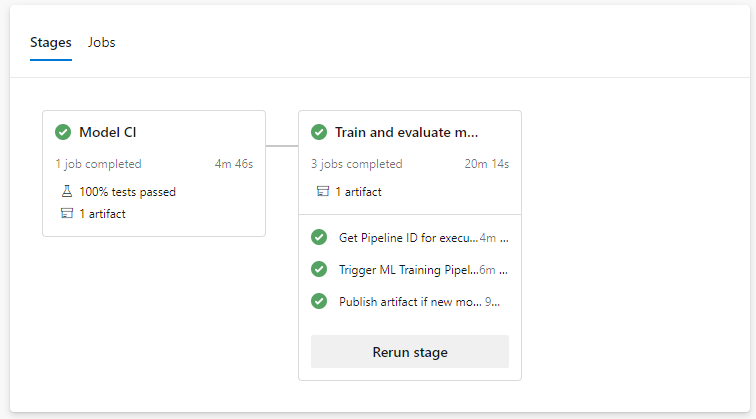
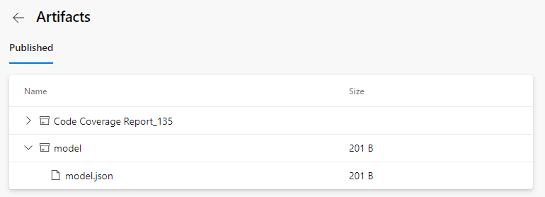
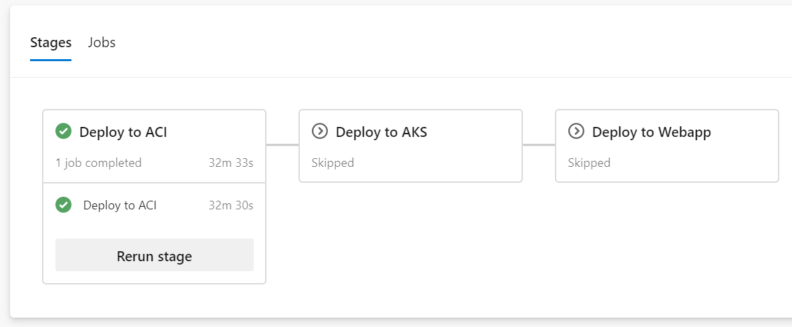
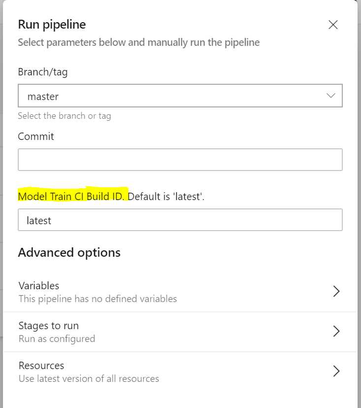

# CI/CD pipelines for model train/register and deployment

Follow this guide to set up two separate pipelines to train/register models and deploy models. This set of pipelines is functionally similar to the [diabetes_regression-ci.yml](../.pipelines/diabetes_regression-ci.yml) pipeline in the [getting started](getting_started.md) guide.

1. **Model CI, training, evaluation, and registration** - triggered on code changes to master branch on GitHub. Runs linting, unit tests, code coverage, and publishes and runs the training pipeline. If a new model is registered after evaluation, it creates a build artifact containing the JSON metadata of the model. Definition: [diabetes_regression-train-register.yml](../.pipelines/diabetes_regression-train-register.yml).
1. **Release deployment** - consumes the artifact of the previous pipeline and deploys a model to either [Azure Container Instances (ACI)](https://azure.microsoft.com/en-us/services/container-instances/), [Azure Kubernetes Service (AKS)](https://azure.microsoft.com/en-us/services/kubernetes-service), or [Azure App Service](https://docs.microsoft.com/en-us/azure/machine-learning/service/how-to-deploy-app-service) environments. Definition: [diabetes_regression-deploy.yml](../.pipelines/diabetes_regression-deploy.yml).

## Prerequisites

---

It is recommended to go through the [getting started guide](getting_started.md) before starting this guide.

---

Before continuing this guide, you will need:

- An existing workspace. To setup your environment with a new workspace, follow the steps here.
- An Azure DevOps Service Connection with your Azure ML Workspace.
- A variable group named **``devopsforai-aml-vg``** with the required variables set.

## Model CI, training, evaluation, and registration pipeline

In this section, we will create the pipeline that will perform model IC, training, evaluation, and registration.

### Set up the Pipeline

In your Azure DevOps project, create and run a new build pipeline based on the  [diabetes_regression-ci-train-register.yml](../.pipelines/diabetes_regression-ci-train-register.yml)
pipeline definition in your forked repository.

If you plan to use the release deployment pipeline (in the next section), you will need to rename this pipeline to `Model-Train-Register-CI`.

Once the pipeline is finished, check the execution result:

And the pipeline artifacts:

The pipeline stages are summarized below:

#### Model CI

- Linting (code quality analysis)
- Unit tests and code coverage analysis
- Build and publish *ML Training Pipeline* in an *ML Workspace*

#### Train model

- Determine the ID of the *ML Training Pipeline* published in the previous stage.
- Trigger the *ML Training Pipeline* and waits for it to complete.
  - This is an **agentless** job. The CI pipeline can wait for ML pipeline completion for hours or even days without using agent resources.
- Determine if a new model was registered by the *ML Training Pipeline*.
  - If the model evaluation determines that the new model doesn't perform any better than the previous one, the new model won't register and the *ML Training Pipeline* will be **canceled**. In this case, you'll see a message in the 'Train Model' job under the 'Determine if evaluation succeeded and new model is registered' step saying '**Model was not registered for this run.**'
  - See [evaluate_model.py](../diabetes_regression/evaluate/evaluate_model.py#L118) for the evaluation logic.
  - [Additional Variables and Configuration](getting_started.md#additional-variables-and-configuration) for configuring this and other behavior.

#### Create pipeline artifact

- Get the info about the registered model
- Create a pipeline artifact called `model` that contains a `model.json` file containing the model information.

## Release deployment pipeline

---
**PREREQUISITE**

In order to use this pipeline:

1. Follow the steps to set up the Model CI, training, evaluation, and registration pipeline.
1. You **must** rename your model CI/train/eval/register pipeline to `Model-Train-Register-CI`.

The release deploymment pipeline relies on the model CI pipeline and references it by name.

---

In this section, we will set up the pipeline for release deployment to ACI, AKS, or Webapp. This pipeline uses the resulting artifact of the [Model-Train-Register-CI pipeline](#) to identify the model to be deployed.

This pipeline has the following behaviors:

- The pipeline will **automatically trigger** on completion of the Model-Train-Register-CI pipeline
- The pipeline will default to using the latest successful build of the Model-Train-Register-CI pipeline. It will deploy the model produced by that build.
- You can specify a `Model-Train-Register-CI` build ID when running the pipeline manually. You can find this in the url of the build, and the model registered from that build will also be tagged with the build ID.

### Set up the pipeline

In your Azure DevOps project, create and run a new build pipeline based on the  [diabetes_regression-cd-deploy.yml](../.pipelines/diabetes_regression-cd-deploy.yml)
pipeline definition in your forked repository.

Your first run will use the latest model created by the `Model-Train-Register-CI` pipeline.

Once the pipeline is finished, check the execution result:

To specify a particular build's model, set the `Model Train CI Build Id` parameter to the build Id you would like to use.

Once your pipeline run begins, you can see the model name and version downloaded from the `Model-Train-Register-CI` pipeline.

The pipeline has the following stage:

#### Deploy to ACI

- Deploy the model to the QA environment in [Azure Container Instances](https://azure.microsoft.com/en-us/services/container-instances/).
- Smoke test
  - The test sends a sample query to the scoring web service and verifies that it returns the expected response. Have a look at the [smoke test code](../ml_service/util/smoke_test_scoring_service.py) for an example.

See [Further Exploration](getting_started.md#further-exploration) to learn about other deployment targets.
